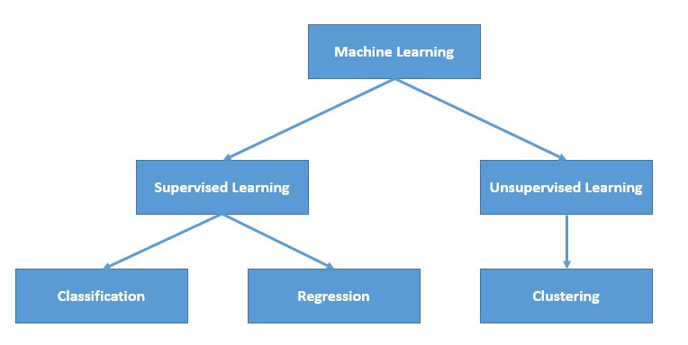
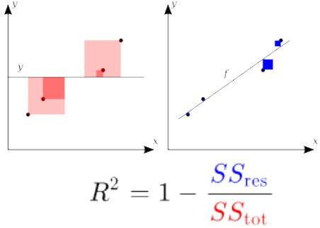
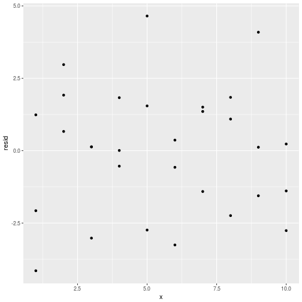

Linear Regression
========================================================
author: Wim van der Ham
date: 2018-02-22
autosize: true

Overview
========================================================



Linear Regression
========================================================

- Supervised learning
- Predicting a quantitative response
- Uses Least Squares to get the coefficients

Formula:

$y = β_0 + β_1 * x_1 + β_2 * x_2 + . . . + β_p * x_p$

In R: `lm()`

Check with the Eye
========================================================


Make Model
========================================================


```r
sim1_mod <- lm(y ~ x, data = sim1)
```

Check Model Using Summary
========================================================


```

Call:
lm(formula = y ~ x, data = sim1)

Residuals:
    Min      1Q  Median      3Q     Max 
-4.1469 -1.5197  0.1331  1.4670  4.6516 

Coefficients:
            Estimate Std. Error t value Pr(>|t|)    
(Intercept)   4.2208     0.8688   4.858 4.09e-05 ***
x             2.0515     0.1400  14.651 1.17e-14 ***
---
Signif. codes:  0 '***' 0.001 '**' 0.01 '*' 0.05 '.' 0.1 ' ' 1

Residual standard error: 2.203 on 28 degrees of freedom
Multiple R-squared:  0.8846,	Adjusted R-squared:  0.8805 
F-statistic: 214.7 on 1 and 28 DF,  p-value: 1.173e-14
```

Check Model Using Summary Coefficients
========================================================

**Call** the call used to create the model

**Residuals** description of the distribution of the residuals, median should be close to 0, 1Q and 3Q should be more or less the same

**Estimate** the estimated values for the coefficients

**Std. Error** the standard error, can be used to calculate confidence intervals for the estimates

**t value** the t-statistic, a measure of the number of sd the estimate is away from 0

**Pr(>|t|)** the p-value for the t-test

Check Model Using Summary Coefficients
========================================================

**Residual standard error** the standard error that describes the distribution of your residuals

**Multiple R-squared** the normal R-squared

**Adjusted R-squared** R-squared compensated for the number of variables

**p-value** the p-value for the whole model

**F-statistic** tells you if the additional variables make the model significantly better than the intercept only model

Correlation - R
========================================================

> Correlation, which always takes values between -1 and 1, describes the strength
of the linear relationship between two variables. We denote the correlation by R


```r
R <- cor(sim1$x, sim1$y)
R^2
```

```
[1] 0.8846124
```

R squared
========================================================



Adjusted R squared
========================================================

- Is always smaller or equal to the R squared
- Adds a cost for adding more variables

ANOVA
========================================================

- Method for comparing the mean between different groups
- Compensates for many pairwise comparisons

**H<sub>0</sub>**: Null hypothesis. All the means of the groups are equal.

**H<sub>A</sub>**: Alternative hypothesis. At least one mean is different.

ANOVA - Conditions
========================================================

1. Observations are independent within and across groups
1. Data within each group are nearly normal
1. Variability across the groups is about equal

F - test
========================================================

- F value is **mean square between groups** / **mean square error**
- F should be around 1 when there is no effect
- Using the F-distribution and two degree of freedom values the p-value can be calculated
  - df<sub>1</sub> = nr_groups - 1
  - df<sub>2</sub> = nr_data_points - nr_groups

ANOVA - Example
========================================================
  

```r
anova(sim1_mod)
```

```
Analysis of Variance Table

Response: y
          Df  Sum Sq Mean Sq F value    Pr(>F)    
x          1 1041.68 1041.68  214.66 1.173e-14 ***
Residuals 28  135.87    4.85                      
---
Signif. codes:  0 '***' 0.001 '**' 0.01 '*' 0.05 '.' 0.1 ' ' 1
```

Check Model Graphically
========================================================


Check Residuals Distribution
========================================================


Check Residuals
========================================================



Exercise - Load the Data
========================================================


```r
library(nycflights13)
flights = as_data_frame(flights)
```

Exercise - Questions
========================================================

Predict the delay of each flight

1. Explore with graphics
1. Make a model
