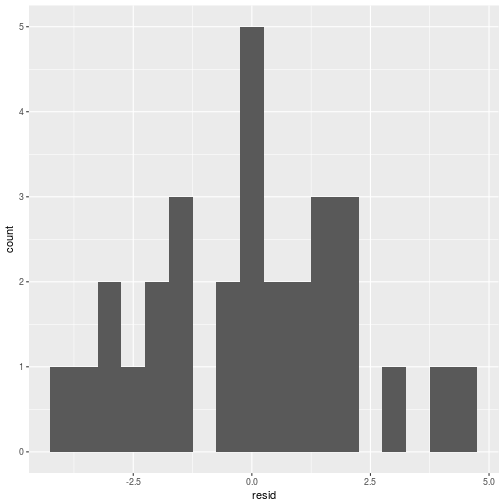

Linear Regression
========================================================
author: Wim van der Ham
date: 2018-02-04
autosize: true

Linear Regression
========================================================

- Supervised learning
- Predicting a quantitative response
- Uses Least Squares to get the coefficients

Formula:

$y = β_0 + β_1 * x_1 + β_2 * x_2 + . . . + β_p * x_p$

In R: `lm()`

Check with the Eye
========================================================


Make Model
========================================================


```r
sim1_mod <- lm(y ~ x, data = sim1)
```

Check Model Using Summary
========================================================


```

Call:
lm(formula = y ~ x, data = sim1)

Residuals:
    Min      1Q  Median      3Q     Max 
-4.1469 -1.5197  0.1331  1.4670  4.6516 

Coefficients:
            Estimate Std. Error t value Pr(>|t|)    
(Intercept)   4.2208     0.8688   4.858 4.09e-05 ***
x             2.0515     0.1400  14.651 1.17e-14 ***
---
Signif. codes:  0 '***' 0.001 '**' 0.01 '*' 0.05 '.' 0.1 ' ' 1

Residual standard error: 2.203 on 28 degrees of freedom
Multiple R-squared:  0.8846,	Adjusted R-squared:  0.8805 
F-statistic: 214.7 on 1 and 28 DF,  p-value: 1.173e-14
```

Check Model Using Summary Coefficients
========================================================

**Call** the call used to create the model

**Residuals** description of the distribution of the residuals, median should be close to 0, 1Q and 3Q should be more or less the same

**Estimate** the estimated values for the coefficients

**Std. Error** the standard error, can be used to calculate confidence intervals for the estimates

**t value** the t-statistic, a measure of the number of sd the estimate is away from 0

**Pr(>|t|)** the p-value for the t-test

Check Model Using Summary Coefficients
========================================================

**Residual standard error** the standard error that describes the distribution of your residuals

**Multiple R-squared**

**Adjusted R-squared** R-squared compensated for the number of variables

**p-value** the p-value for the whole model

Check Model Graphically
========================================================


Check Residuals Distribution
========================================================



Check Residuals
========================================================


