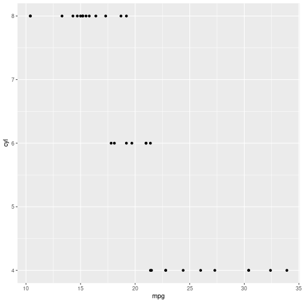
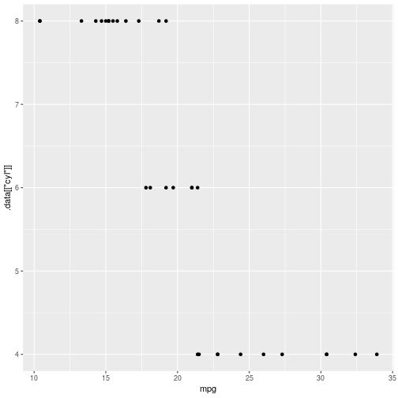

Curly curly
========================================================
author: Wim van der Ham
autosize: true

Example of Duplication
========================================================


```r
df1 %>% group_by(x1) %>% 
  summarise(mean = mean(y1))
df2 %>% group_by(x2) %>% 
  summarise(mean = mean(y2))
df3 %>% group_by(x3) %>% 
  summarise(mean = mean(y3))
df4 %>% group_by(x4) %>% 
  summarise(mean = mean(y4))
```

Write a Function to Reduce Duplication
========================================================


```r
grouped_mean <- function(data, group_var, summary_var) {
  data %>%
    group_by(group_var) %>%
    summarise(mean = mean(summary_var))
}
```

But does not Work...
========================================================


```r
grouped_mean(mtcars, cyl, mpg)
```

What Works
========================================================


```r
grouped_mean <- function(data, group_var, summary_var) {
  data %>%
    group_by({{group_var}}) %>%
    summarise(mean = mean({{summary_var}}))
}
```


```r
grouped_mean(mtcars, cyl, mpg)
```

```
# A tibble: 3 x 2
    cyl  mean
* <dbl> <dbl>
1     4  26.7
2     6  19.7
3     8  15.1
```

Same for ggplot
========================================================


```r
plot_mpg_vs <- function(y_var){
  ggplot(mtcars) +  
  geom_point(aes(mpg, {{y_var}}))
}

plot_mpg_vs(cyl)
```



When the Input is a String
========================================================


```r
grouped_mean <- function(data, group_var, summary_var) {
  data %>%
    group_by(.data[[group_var]]) %>%
    summarise(mean = mean(.data[[summary_var]], na.rm = TRUE))
}

grouped_mean(mtcars, "cyl", "mpg")
```

```
# A tibble: 3 x 2
    cyl  mean
* <dbl> <dbl>
1     4  26.7
2     6  19.7
3     8  15.1
```

When the Input is a String in ggplot
========================================================


```r
plot_mpg_vs <- function(y_var){
  ggplot(mtcars) +  
  geom_point(aes(mpg, .data[[y_var]]))
}

plot_mpg_vs("cyl")
```


