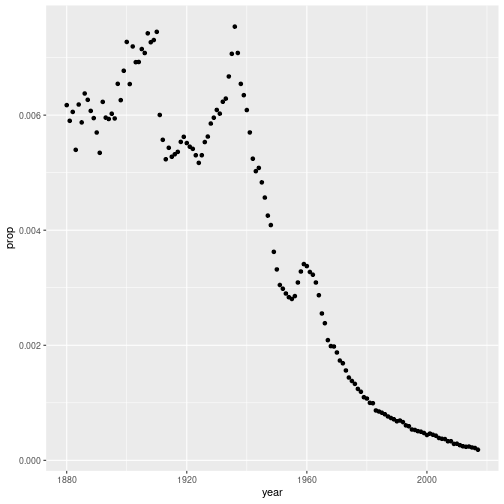
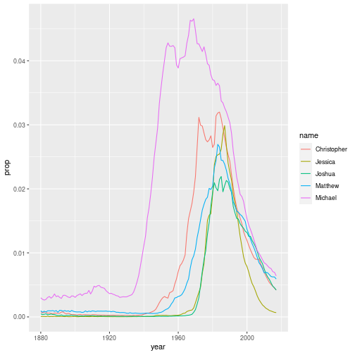
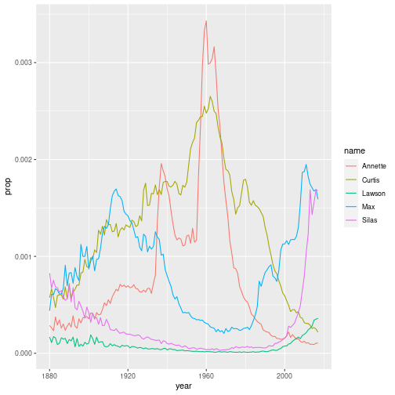

Nesting
========================================================
author: Wim van der Ham
width: 1440
height: 900

Why nest?
========================================================

`nest()` is usefull when you want to apply the same function to different sets of data. For example train a model on differet data sets, or make a plot of different datasets.

Pattern
========================================================


```r
df %>%
  group_by(.grouping_col) %>%
  nest() %>%
  mutate(.new_col = map(data, .f))
```

- `.grouping_col` column(s) where you want to group your datasets on. `nest()` wil split the groups
- `.f` function that you want to apply to all datasets, can be `lm()`, `ggplot()` etc.
- `.new_col` name of the new column where the results are stored.

If you want to go back to the original dataset you have to use `unnest(data)`


```r
df %>%
  unnest(data) 
```

When do we need map() in mutate()?
========================================================

- When you have a list column you need `map()`. `nest()` created list columns.
- When you have a vector column you do not need `map()` (but it would also work). All *normal* df have vector columns.

**NOTE** The result of `map()` in `mutate()` is again a list column. If you do not want this you have to use a more specific version of `map()` see [here](https://purrr.tidyverse.org/reference/map.html). 

Example
========================================================


```r
df <- tibble(
  a = c(1, 2, 3),
  b = list(4, 5, 6)
)
times2 <- function(x) {
  x * 2
}
df %>%
  mutate(result = times2(a))
```

```
# A tibble: 3 x 3
      a b         result
  <dbl> <list>     <dbl>
1     1 <dbl [1]>      2
2     2 <dbl [1]>      4
3     3 <dbl [1]>      6
```

========================================================


```r
df %>%
  mutate(test = times2(b))
```


```r
df %>%
  mutate(test = map(b, times2))
```

```
# A tibble: 3 x 3
      a b         test     
  <dbl> <list>    <list>   
1     1 <dbl [1]> <dbl [1]>
2     2 <dbl [1]> <dbl [1]>
3     3 <dbl [1]> <dbl [1]>
```

```r
df %>%
  mutate(test = map_dbl(b, times2))
```

```
# A tibble: 3 x 3
      a b          test
  <dbl> <list>    <dbl>
1     1 <dbl [1]>     8
2     2 <dbl [1]>    10
3     3 <dbl [1]>    12
```

nest example with babynames
========================================================


```r
babynames_everpresent
```

```
# A tibble: 128,064 x 5
    year sex   name          n   prop
   <dbl> <chr> <chr>     <int>  <dbl>
 1  1880 F     Mary       7065 0.0724
 2  1880 F     Anna       2604 0.0267
 3  1880 F     Emma       2003 0.0205
 4  1880 F     Elizabeth  1939 0.0199
 5  1880 F     Minnie     1746 0.0179
 6  1880 F     Margaret   1578 0.0162
 7  1880 F     Ida        1472 0.0151
 8  1880 F     Alice      1414 0.0145
 9  1880 F     Bertha     1320 0.0135
10  1880 F     Sarah      1288 0.0132
# … with 128,054 more rows
```

Do it for one name - Plot
========================================================


```r
joe <- babynames_everpresent %>% 
  filter(name == "Joe" & sex == "M")
ggplot(joe) +
  geom_point(aes(year, prop))
```



Do it for one name - Fit
========================================================


```r
fit_joe <- lm(prop ~ year, data = joe)
coef(fit_joe)['year']
```

```
         year 
-5.826562e-05 
```

```r
summary(fit_joe)$r.squared
```

```
[1] 0.8620268
```

Do it for all using nest()
========================================================


```r
make_model <- function(x) {
  lm(prop ~ year, data = x)
}
get_slope <- function(fit) {
  coef(fit)['year']
}
get_r_squared <- function(fit) {
  summary(fit)$r.squared
}
```

========================================================


```r
babymods <- babynames_everpresent %>% 
  group_by(name, sex) %>% 
  nest() %>%
  mutate(
    fit = map(data, make_model),
    slope = map_dbl(fit, get_slope),
    r_squared = map_dbl(fit, get_r_squared)
  )
babymods
```

```
# A tibble: 928 x 6
# Groups:   sex, name [928]
   sex   name      data               fit          slope r_squared
   <chr> <chr>     <list>             <list>       <dbl>     <dbl>
 1 F     Mary      <tibble [138 × 3]> <lm>   -0.000572     0.914  
 2 F     Anna      <tibble [138 × 3]> <lm>   -0.000176     0.703  
 3 F     Emma      <tibble [138 × 3]> <lm>   -0.0000597    0.196  
 4 F     Elizabeth <tibble [138 × 3]> <lm>   -0.0000729    0.715  
 5 F     Minnie    <tibble [138 × 3]> <lm>   -0.0000943    0.638  
 6 F     Margaret  <tibble [138 × 3]> <lm>   -0.000171     0.804  
 7 F     Ida       <tibble [138 × 3]> <lm>   -0.0000842    0.712  
 8 F     Alice     <tibble [138 × 3]> <lm>   -0.000108     0.890  
 9 F     Bertha    <tibble [138 × 3]> <lm>   -0.0000927    0.750  
10 F     Sarah     <tibble [138 × 3]> <lm>    0.00000565   0.00324
# … with 918 more rows
```

Plot 5 names with biggest slope
========================================================


```r
babymods %>% 
  arrange(desc(slope)) %>% 
  head(5) %>% 
  unnest(data) %>% 
  ggplot() +
    geom_line(aes(year, prop, color = name))
```



Plot 5 names with lowest r squared
========================================================


```r
babymods %>% 
  arrange(r_squared) %>% 
  head(5) %>% 
  unnest(data) %>% 
  ggplot() +
    geom_line(aes(year, prop, color = name))
```


