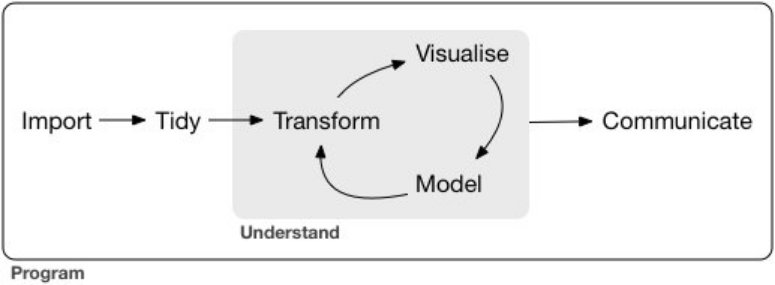

Introduction
========================================================
author: Wim van der Ham
autosize: true

About Myself
========================================================

Wim van der Ham 

wfjvdham@gmail.com

Master Human Media Interaction (AI)

***

**Experience:**

- Quby
- KPN
- Tomato Glass House
- Teaching R and ML

About You?
========================================================

- What is your level of experience with R?
- What would you like to learn in this course?

About This Course
========================================================

- Flexible
- Practical
- [GitHub](https://github.com/wfjvdham/Rcourse)
- [More References](https://github.com/wfjvdham/Rcourse/blob/master/references.md)

About R
========================================================

A language that is good at: 
  - Reading data
  - Analyzing data
  - Modeling
  - Making graphics
  - Presenting results

About R
========================================================  

- All data is loaded in memory
- Open-source
- A lot of packages are available
  - [CRAN](https://cran.rstudio.com/)
  - [Bioconductor](https://www.bioconductor.org/)
  - [GitHub](https://github.com)

Style
========================================================  

[The tidyverse style guide](http://style.tidyverse.org/)

**Tools**

- [styler](http://styler.r-lib.org/index.html)
- [lintr](https://github.com/jimhester/lintr)

R Work Flow
========================================================



R Installation
========================================================

R

https://cran.r-project.org/

RStudio

http://www.rstudio.com/download

R Studio
========================================================

- Content of Files
- Console
- Environment, History, Connections, ...
- Files, Plots, Packages, Help, Viewer

Tidyverse
========================================================

https://www.tidyverse.org/


Use Packages
========================================================

Install - one time


```r
install.packages("tidyverse")
```

Load - every time you start with using R


```r
library("tidyverse")
```

Get Help
========================================================


```r
?cut()
help(cut)
?mtcars
help(mtcars)
```

Work in a Project
========================================================

- Working directories are set correctly automatically so sharing becomes easy.
- Files and scripts that belong together are kept together.

Open the Rcourse.Rproj file to start!
