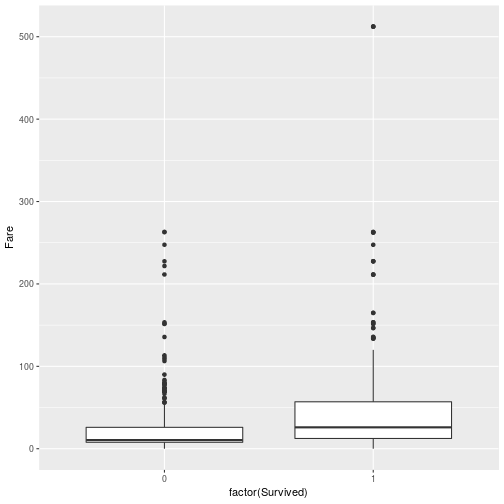

ggplot
========================================================
author: Wim van der Ham
width: 1440
height: 900

Work Flow
========================================================


Why use Graphs
========================================================

From Anscombe, Francis J. (1973) Graphs in statistical analysis. American Statistician, 27, 17–21.


ggplot2
========================================================

- Inside `ggplot()` you define the data used
- With [`geom_*()`](http://ggplot2.tidyverse.org/reference/index.html#section-layer-geoms) you specify the type of plot
- Inside `aes()` you connect columns to parts of the graph

Type of Graphics - 1 Variable
========================================================

| Type `x` | *First* Graphic |
| --- | --- |
| Discrete | `geom_bar(aes(x))` |
| Continuous | `geom_histogram(aes(x))` |

geom_bar(aes(x))
========================================================


```r
ggplot(titanic_train) +
  geom_bar(aes(Pclass))
```


geom_histogram(aes(x))
========================================================


```r
ggplot(titanic_train) +
  geom_histogram(aes(Age), binwidth = 10)
```


Type of Graphics - 2 Variables
========================================================

| Type of `x` | Type of `y` | *First* Graphic |
| --- | --- | --- |
| Discrete | Discrete | `geom_bar(aes(x, fill = y), position = "dodge")`|
| Discrete | Continuous | `geom_boxplot(aes(x, y))` |
| Continuous | Continuous | `geom_point(aes(x, y))`* |

* When there is too much data, one of the variables has to be changed to discrete using `cut()`. Or you can use `geom_bin2d()`

geom_bar position = "dodge"
========================================================


```r
ggplot(titanic_train) +
  geom_bar(aes(Pclass, fill = Sex), position = "dodge")
```


geom_boxplot(aes(x, y))
========================================================


```r
ggplot(titanic_train) +
  geom_boxplot(aes(factor(Survived), Fare))
```



geom_point(aes(x, y))
========================================================


```r
ggplot(titanic_train) +
  geom_point(aes(Age, Fare))
```


geom_boxplot(aes(x, y)) and cut()
========================================================

With `cut()` you can change a continues varibale into a discrete one. The `breaks` argument can be used in two ways:

- The number of groups
- a `c()` with the breaks

***


```r
ggplot(titanic_train) +
  geom_boxplot(
    aes(cut(Age, 5), Fare)
  )
```


Type of Graphics - 3 Variables
========================================================

| Type of `x` | Type of `y` | Type of `z` | *First* Graphic |
| --- | --- | --- | --- |
| Discrete | Discrete | Discrete | ??? |
| Discrete | Discrete | Continuous | `geom_bar(aes(x, z, fill = y), stat = "identity", position = "dodge")` |
| Discrete / Continuous| Continuous | Continuous | `geom_point(aes(y, z, color = x))` |

geom_bar() identity dodge
========================================================


```r
ggplot(titanic_train_sum) +
  geom_bar(aes(Pclass, perc_survived, fill = Sex), 
           stat = "identity", position = "dodge")
```


geom_point(aes(y, z, color = x))
========================================================


```r
ggplot(titanic_train) +
  geom_point(aes(Age, Fare, color = Pclass))
```


geom_point(aes(y, z, color = x))
========================================================


```r
ggplot(titanic_train) +
  geom_point(aes(Age, Fare, color = factor(Pclass)))
```


Labels
========================================================

**Always** label your axis and use a title

Title should be a conclusion, not a description

Labels - example
========================================================


```r
ggplot(titanic_train) +
  geom_point(aes(Age, Fare)) +
  labs(
    title = "Age and Fare are not related",
    x = "Age in Years",
    y = "Fare in Dollars"
  )
```


coord_flip()
========================================================

Usefull when the labels on the x axis are long and overlapping


```r
ggplot(titanic_train) + 
  geom_bar(aes(Sex)) +
  coord_flip()
```


Zoom
========================================================

In most cases you can use `xlim()` and `ylim()` to set the limits of the axis


```r
ggplot(titanic_train) +
  geom_point(aes(Age, Fare)) +
  xlim(10, 30) +
  ylim(0, 100)
```


Zoom - Without filtering out data
========================================================

Only with `geom_boxplot()` this is risky because it changes the actual output. So use `coord_cartesian()`. 


```r
ggplot(titanic_train) + 
  geom_boxplot(aes(factor(Pclass), Fare)) + 
  coord_cartesian(ylim = c(0, 100))
```


