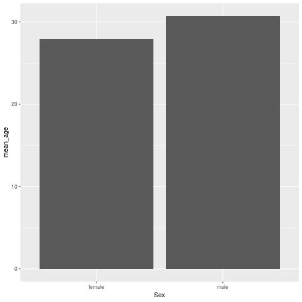

dplyr
========================================================
author: Wim van der Ham
autosize: true

Pipe %>%
========================================================


```r
sin(sqrt(log(10)))
```

```
[1] 0.9985762
```


```r
10 %>%
  log %>%
  sqrt %>%
  sin
```

```
[1] 0.9985762
```

dplyr - Most important functions
========================================================

| function | description | SQL |
| --- | --- | --- |
| `select()` | Select specific columns | SELECT |
| `filter()` | Filter rows using a condition | WHERE |
| `mutate()` | Add a new column using a function | |
| `group_by()` | Make groups | GROUP BY |
| `summarise()` | Calculate some values per group | |
| `arrange()` | Sort | ORDER BY |

select() - Column names
========================================================


```r
titanic_train %>%
  select(Sex, Fare)
```

```
# A tibble: 891 x 2
   Sex     Fare
   <chr>  <dbl>
 1 male    7.25
 2 female 71.3 
 3 female  7.92
 4 female 53.1 
 5 male    8.05
 6 male    8.46
 7 male   51.9 
 8 male   21.1 
 9 female 11.1 
10 female 30.1 
# … with 881 more rows
```

select() - Negated column names
========================================================


```r
titanic_train %>%
  select(-Age)
```

```
# A tibble: 891 x 11
   PassengerId Survived Pclass Name  Sex   SibSp Parch Ticket  Fare Cabin
         <int>    <int>  <int> <chr> <chr> <int> <int> <chr>  <dbl> <chr>
 1           1        0      3 Brau… male      1     0 A/5 2…  7.25 ""   
 2           2        1      1 Cumi… fema…     1     0 PC 17… 71.3  C85  
 3           3        1      3 Heik… fema…     0     0 STON/…  7.92 ""   
 4           4        1      1 Futr… fema…     1     0 113803 53.1  C123 
 5           5        0      3 Alle… male      0     0 373450  8.05 ""   
 6           6        0      3 Mora… male      0     0 330877  8.46 ""   
 7           7        0      1 McCa… male      0     0 17463  51.9  E46  
 8           8        0      3 Pals… male      3     1 349909 21.1  ""   
 9           9        1      3 John… fema…     0     2 347742 11.1  ""   
10          10        1      2 Nass… fema…     1     0 237736 30.1  ""   
# … with 881 more rows, and 1 more variable: Embarked <chr>
```

select() - Colon with column names
========================================================


```r
titanic_train %>%
  select(Sex:Parch)
```

```
# A tibble: 891 x 4
   Sex      Age SibSp Parch
   <chr>  <dbl> <int> <int>
 1 male      22     1     0
 2 female    38     1     0
 3 female    26     0     0
 4 female    35     1     0
 5 male      35     0     0
 6 male      NA     0     0
 7 male      54     0     0
 8 male       2     3     1
 9 female    27     0     2
10 female    14     1     0
# … with 881 more rows
```

select() - Colon with numbers
========================================================


```r
titanic_train %>%
  select(1:3)
```

```
# A tibble: 891 x 3
   PassengerId Survived Pclass
         <int>    <int>  <int>
 1           1        0      3
 2           2        1      1
 3           3        1      3
 4           4        1      1
 5           5        0      3
 6           6        0      3
 7           7        0      1
 8           8        0      3
 9           9        1      3
10          10        1      2
# … with 881 more rows
```

Condition
========================================================

> Expression that can be `TRUE` or `FALSE`

| | |
| --- | ---|
| **`==`** | is equal |
| **`!=`** | is not equal |
| **`>=`, `>`, `=<`, `<`** | comparison |
| **<code>&</code>, <code>&#124;</code>** | logical comparison|
| **`%in%`** | is in a list or vector |
| **`is.na()`** | is equal to `NA` |
| **`!`** | reverses the result of a condition |

filter() - Single condition
========================================================


```r
titanic_train %>%
  filter(Sex == "male")
```

```
# A tibble: 577 x 12
   PassengerId Survived Pclass Name  Sex     Age SibSp Parch Ticket  Fare
         <int>    <int>  <int> <chr> <chr> <dbl> <int> <int> <chr>  <dbl>
 1           1        0      3 Brau… male     22     1     0 A/5 2…  7.25
 2           5        0      3 Alle… male     35     0     0 373450  8.05
 3           6        0      3 Mora… male     NA     0     0 330877  8.46
 4           7        0      1 McCa… male     54     0     0 17463  51.9 
 5           8        0      3 Pals… male      2     3     1 349909 21.1 
 6          13        0      3 Saun… male     20     0     0 A/5. …  8.05
 7          14        0      3 Ande… male     39     1     5 347082 31.3 
 8          17        0      3 Rice… male      2     4     1 382652 29.1 
 9          18        1      2 Will… male     NA     0     0 244373 13   
10          21        0      2 Fynn… male     35     0     0 239865 26   
# … with 567 more rows, and 2 more variables: Cabin <chr>, Embarked <chr>
```

filter() - Multiple conditions &
========================================================


```r
titanic_train %>%
  filter(Sex == "male" & Pclass == 1)
```

```
# A tibble: 122 x 12
   PassengerId Survived Pclass Name  Sex     Age SibSp Parch Ticket  Fare
         <int>    <int>  <int> <chr> <chr> <dbl> <int> <int> <chr>  <dbl>
 1           7        0      1 McCa… male     54     0     0 17463   51.9
 2          24        1      1 Slop… male     28     0     0 113788  35.5
 3          28        0      1 Fort… male     19     3     2 19950  263  
 4          31        0      1 Uruc… male     40     0     0 PC 17…  27.7
 5          35        0      1 Meye… male     28     1     0 PC 17…  82.2
 6          36        0      1 Holv… male     42     1     0 113789  52  
 7          55        0      1 Ostb… male     65     0     1 113509  62.0
 8          56        1      1 Wool… male     NA     0     0 19947   35.5
 9          63        0      1 Harr… male     45     1     0 36973   83.5
10          65        0      1 Stew… male     NA     0     0 PC 17…  27.7
# … with 112 more rows, and 2 more variables: Cabin <chr>, Embarked <chr>
```

filter() - Multiple conditions ,
========================================================


```r
titanic_train %>%
  filter(Sex == "male", Pclass %in% c(1, 2))
```

```
# A tibble: 230 x 12
   PassengerId Survived Pclass Name  Sex     Age SibSp Parch Ticket  Fare
         <int>    <int>  <int> <chr> <chr> <dbl> <int> <int> <chr>  <dbl>
 1           7        0      1 McCa… male     54     0     0 17463   51.9
 2          18        1      2 Will… male     NA     0     0 244373  13  
 3          21        0      2 Fynn… male     35     0     0 239865  26  
 4          22        1      2 Bees… male     34     0     0 248698  13  
 5          24        1      1 Slop… male     28     0     0 113788  35.5
 6          28        0      1 Fort… male     19     3     2 19950  263  
 7          31        0      1 Uruc… male     40     0     0 PC 17…  27.7
 8          34        0      2 Whea… male     66     0     0 C.A. …  10.5
 9          35        0      1 Meye… male     28     1     0 PC 17…  82.2
10          36        0      1 Holv… male     42     1     0 113789  52  
# … with 220 more rows, and 2 more variables: Cabin <chr>, Embarked <chr>
```

mutate() 
========================================================


```r
titanic_train %>%
  mutate(Age_10 = Age + 10) %>%
  select(Age, Age_10)
```

```
# A tibble: 891 x 2
     Age Age_10
   <dbl>  <dbl>
 1    22     32
 2    38     48
 3    26     36
 4    35     45
 5    35     45
 6    NA     NA
 7    54     64
 8     2     12
 9    27     37
10    14     24
# … with 881 more rows
```

mutate() 
========================================================


```r
titanic_train %>%
  mutate(Pclass_factor = factor(Pclass)) %>%
  select(Pclass, Pclass_factor)
```

```
# A tibble: 891 x 2
   Pclass Pclass_factor
    <int> <fct>        
 1      3 3            
 2      1 1            
 3      3 3            
 4      1 1            
 5      3 3            
 6      3 3            
 7      1 1            
 8      3 3            
 9      3 3            
10      2 2            
# … with 881 more rows
```

group_by() + summarise() - n()
========================================================


```r
titanic_train %>%
  group_by(Sex) %>%
  summarise(n = n())
```

```
# A tibble: 2 x 2
  Sex        n
  <chr>  <int>
1 female   314
2 male     577
```

count()
========================================================


```r
titanic_train %>%
  count(Sex)
```

```
# A tibble: 2 x 2
  Sex        n
  <chr>  <int>
1 female   314
2 male     577
```

group_by() + summarise() - 1 function
========================================================


```r
titanic_train %>%
  group_by(Sex) %>%
  summarise(
    mean_age = mean(Age, na.rm = TRUE)
  )
```

```
# A tibble: 2 x 2
  Sex    mean_age
  <chr>     <dbl>
1 female     27.9
2 male       30.7
```

group_by() + summarise() - 2 functions
========================================================


```r
titanic_train %>%
  group_by(Sex) %>%
  summarise(
    n = n(),
    missing = sum(is.na(Age))
  )
```

```
# A tibble: 2 x 3
  Sex        n missing
  <chr>  <int>   <int>
1 female   314      53
2 male     577     124
```

summarise() without group_by()
========================================================


```r
titanic_train %>%
  summarise(
    n = n(),
    missing = sum(is.na(Age))
  )
```

```
# A tibble: 1 x 2
      n missing
  <int>   <int>
1   891     177
```

arrange() - Ascending
========================================================


```r
titanic_train %>%
  arrange(Age) %>%
  select(Age)
```

```
# A tibble: 891 x 1
     Age
   <dbl>
 1  0.42
 2  0.67
 3  0.75
 4  0.75
 5  0.83
 6  0.83
 7  0.92
 8  1   
 9  1   
10  1   
# … with 881 more rows
```

arrange() - Descending
========================================================


```r
titanic_train %>%
  arrange(desc(Age)) %>%
  select(Age)
```

```
# A tibble: 891 x 1
     Age
   <dbl>
 1  80  
 2  74  
 3  71  
 4  71  
 5  70.5
 6  70  
 7  70  
 8  66  
 9  65  
10  65  
# … with 881 more rows
```

Calculate a Percentage
========================================================


```r
titanic_train %>%
  group_by(Sex) %>%
  summarise(
    n = n(),
    missing = sum(is.na(Age))
  ) %>%
  mutate(
    perc_missing = missing / sum(n) * 100
  )
```

```
# A tibble: 2 x 4
  Sex        n missing perc_missing
  <chr>  <int>   <int>        <dbl>
1 female   314      53         5.95
2 male     577     124        13.9 
```

Plot a Summary Value
========================================================


```r
mean_age_sex <- titanic_train %>%
  group_by(Sex) %>%
  summarise(
    mean_age = mean(Age, na.rm = TRUE)
  )

ggplot(mean_age_sex) +
  geom_bar(aes(Sex, mean_age), stat = "identity")
```



Extra Functions
========================================================

- `slice()` Select 1 or multiple rows based on the position of the row
- `nrow()` Counts the number of rows of a data frame
- `summary()` Gives summaries of all the variables in a data frame (not tidy!)
- `sum()` Sums all the values
- `mean()` Average of the values
- `median()` Median of the values
- `pull()` Get the values in a column
- `if_else()` Returns different values based on a condition
- `case_when()` Returns different values based on many conditions

Group a Continues Variable
========================================================


```r
titanic_train %>%
  mutate(
    groups = cut(Fare, c(-1, 50, 100, 1000))
  ) %>%
  group_by(groups) %>%
  summarise(n = n())
```

```
# A tibble: 3 x 2
  groups          n
  <fct>       <int>
1 (-1,50]       731
2 (50,100]      107
3 (100,1e+03]    53
```
