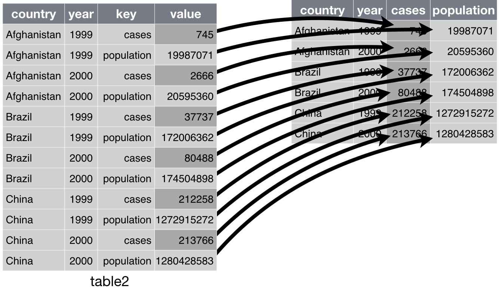
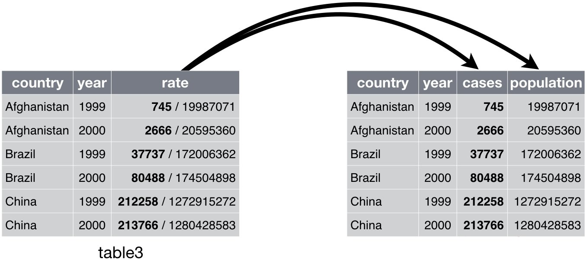

Tidy
========================================================
author: Wim van der Ham
width: 1440
height: 900

Tidy Data
========================================================

1. Each variable is in a column
1. Each observation is a row
1. Each value is a cell

tidy package
========================================================

1. `gather()` Collapse multiple columns into key-value pairs
1. `spread()` Spread a key-value pair across multiple columns
1. `separate()` Split single column into multiple columns

Gather
========================================================


Gather - Arguments
========================================================


```r
df %>%
  gather("key", "value", <columns>)
```

Spread
========================================================



Spread - Arguments
========================================================


```r
df %>%
  spread(<key column>, <value column>)
```

Separate
========================================================



Example - Load example dataset
========================================================


```r
who <- as_tibble(tidyr::who)
```

Example - Gather columns with treathments codes
========================================================


```r
who1 <- who %>% 
  gather("key", "value", new_sp_m014:newrel_f65, na.rm = TRUE)
who1
```

```
# A tibble: 76,046 x 6
   country     iso2  iso3   year key         value
   <chr>       <chr> <chr> <int> <chr>       <int>
 1 Afghanistan AF    AFG    1997 new_sp_m014     0
 2 Afghanistan AF    AFG    1998 new_sp_m014    30
 3 Afghanistan AF    AFG    1999 new_sp_m014     8
 4 Afghanistan AF    AFG    2000 new_sp_m014    52
 5 Afghanistan AF    AFG    2001 new_sp_m014   129
 6 Afghanistan AF    AFG    2002 new_sp_m014    90
 7 Afghanistan AF    AFG    2003 new_sp_m014   127
 8 Afghanistan AF    AFG    2004 new_sp_m014   139
 9 Afghanistan AF    AFG    2005 new_sp_m014   151
10 Afghanistan AF    AFG    2006 new_sp_m014   193
# … with 76,036 more rows
```

Example - Count them to check keys
========================================================


```r
who1 %>% 
  group_by(key) %>%
  summarise(n = n())
```

```
# A tibble: 56 x 2
   key              n
   <chr>        <int>
 1 new_ep_f014   1032
 2 new_ep_f1524  1021
 3 new_ep_f2534  1021
 4 new_ep_f3544  1021
 5 new_ep_f4554  1017
 6 new_ep_f5564  1017
 7 new_ep_f65    1014
 8 new_ep_m014   1038
 9 new_ep_m1524  1026
10 new_ep_m2534  1020
# … with 46 more rows
```

Example - Fix typo in key
========================================================


```r
who2 <- who1 %>% 
  mutate(key = str_replace(key, "newrel", "new_rel"))
who2
```

```
# A tibble: 76,046 x 6
   country     iso2  iso3   year key         value
   <chr>       <chr> <chr> <int> <chr>       <int>
 1 Afghanistan AF    AFG    1997 new_sp_m014     0
 2 Afghanistan AF    AFG    1998 new_sp_m014    30
 3 Afghanistan AF    AFG    1999 new_sp_m014     8
 4 Afghanistan AF    AFG    2000 new_sp_m014    52
 5 Afghanistan AF    AFG    2001 new_sp_m014   129
 6 Afghanistan AF    AFG    2002 new_sp_m014    90
 7 Afghanistan AF    AFG    2003 new_sp_m014   127
 8 Afghanistan AF    AFG    2004 new_sp_m014   139
 9 Afghanistan AF    AFG    2005 new_sp_m014   151
10 Afghanistan AF    AFG    2006 new_sp_m014   193
# … with 76,036 more rows
```

Example - Check if fixed
========================================================


```r
who2 %>% 
  count(key)
```

```
# A tibble: 56 x 2
   key              n
   <chr>        <int>
 1 new_ep_f014   1032
 2 new_ep_f1524  1021
 3 new_ep_f2534  1021
 4 new_ep_f3544  1021
 5 new_ep_f4554  1017
 6 new_ep_f5564  1017
 7 new_ep_f65    1014
 8 new_ep_m014   1038
 9 new_ep_m1524  1026
10 new_ep_m2534  1020
# … with 46 more rows
```

Example - Seperate the key value into columns
========================================================


```r
who3 <- who2 %>% 
  separate(key, c("new", "type", "sexage"), sep = "_")
who3
```

```
# A tibble: 76,046 x 8
   country     iso2  iso3   year new   type  sexage value
   <chr>       <chr> <chr> <int> <chr> <chr> <chr>  <int>
 1 Afghanistan AF    AFG    1997 new   sp    m014       0
 2 Afghanistan AF    AFG    1998 new   sp    m014      30
 3 Afghanistan AF    AFG    1999 new   sp    m014       8
 4 Afghanistan AF    AFG    2000 new   sp    m014      52
 5 Afghanistan AF    AFG    2001 new   sp    m014     129
 6 Afghanistan AF    AFG    2002 new   sp    m014      90
 7 Afghanistan AF    AFG    2003 new   sp    m014     127
 8 Afghanistan AF    AFG    2004 new   sp    m014     139
 9 Afghanistan AF    AFG    2005 new   sp    m014     151
10 Afghanistan AF    AFG    2006 new   sp    m014     193
# … with 76,036 more rows
```

Example - Drop columns
========================================================


```r
who4 <- who3 %>% 
  select(-new, -iso2, -iso3)
who4
```

```
# A tibble: 76,046 x 5
   country      year type  sexage value
   <chr>       <int> <chr> <chr>  <int>
 1 Afghanistan  1997 sp    m014       0
 2 Afghanistan  1998 sp    m014      30
 3 Afghanistan  1999 sp    m014       8
 4 Afghanistan  2000 sp    m014      52
 5 Afghanistan  2001 sp    m014     129
 6 Afghanistan  2002 sp    m014      90
 7 Afghanistan  2003 sp    m014     127
 8 Afghanistan  2004 sp    m014     139
 9 Afghanistan  2005 sp    m014     151
10 Afghanistan  2006 sp    m014     193
# … with 76,036 more rows
```

Example - Split sexage into sex and age
========================================================


```r
who5 <- who4 %>% 
  separate(sexage, c("sex", "age"), sep = 1)
who5
```

```
# A tibble: 76,046 x 6
   country      year type  sex   age   value
   <chr>       <int> <chr> <chr> <chr> <int>
 1 Afghanistan  1997 sp    m     014       0
 2 Afghanistan  1998 sp    m     014      30
 3 Afghanistan  1999 sp    m     014       8
 4 Afghanistan  2000 sp    m     014      52
 5 Afghanistan  2001 sp    m     014     129
 6 Afghanistan  2002 sp    m     014      90
 7 Afghanistan  2003 sp    m     014     127
 8 Afghanistan  2004 sp    m     014     139
 9 Afghanistan  2005 sp    m     014     151
10 Afghanistan  2006 sp    m     014     193
# … with 76,036 more rows
```
