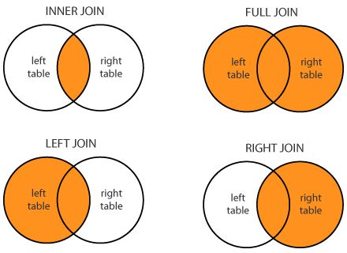

join
========================================================
author: Wim van der Ham
width: 1440
height: 900

Join
========================================================

> Combine multiple data frames into 1 based on one or more columns

merge() vs join
========================================================

For joining data frames you can use the `merge()` function from `base` or the join functions from the `dplyr` package. The last ones have the following [advantages](https://groups.google.com/forum/#!topic/manipulatr/OuAPC4VyfIc) above the `merge()` function:

* Rows are kept in existing order
* Much faster
* Tells you what keys you’re merging by (if you don’t supply)
* Also work with database tables

Type of joins
========================================================



Join - 1 column
========================================================


```r
flights2 %>% 
  left_join(airlines)
```

```
# A tibble: 20,000 x 7
    year  hour origin dest  tailnum carrier name                    
   <int> <dbl> <chr>  <chr> <chr>   <chr>   <chr>                   
 1  2013     6 JFK    RSW   N529JB  B6      JetBlue Airways         
 2  2013    14 JFK    JAX   N197JB  B6      JetBlue Airways         
 3  2013    16 JFK    SFO   N842VA  VX      Virgin America          
 4  2013    10 LGA    IAH   N562UA  UA      United Air Lines Inc.   
 5  2013     6 EWR    ATL   N11199  EV      ExpressJet Airlines Inc.
 6  2013    15 LGA    MIA   N3ARAA  AA      American Airlines Inc.  
 7  2013     9 JFK    LAS   N837VA  VX      Virgin America          
 8  2013    17 JFK    AUS   N3BWAA  AA      American Airlines Inc.  
 9  2013    13 JFK    LAX   N628VA  VX      Virgin America          
10  2013     7 JFK    SFO   N766JB  B6      JetBlue Airways         
# … with 19,990 more rows
```

Join - Multiple columns
========================================================


```r
flights2 %>% 
  left_join(weather)
```

```
# A tibble: 7,262,714 x 18
    year  hour origin dest  tailnum carrier month   day  temp  dewp humid
   <dbl> <dbl> <chr>  <chr> <chr>   <chr>   <dbl> <int> <dbl> <dbl> <dbl>
 1  2013     6 JFK    RSW   N529JB  B6          1     1  37.9 27.0   64.3
 2  2013     6 JFK    RSW   N529JB  B6          1     2  23    8.96  54.3
 3  2013     6 JFK    RSW   N529JB  B6          1     3  26.1 14     59.8
 4  2013     6 JFK    RSW   N529JB  B6          1     4  33.1 21.0   60.8
 5  2013     6 JFK    RSW   N529JB  B6          1     5  33.1 18.0   53.4
 6  2013     6 JFK    RSW   N529JB  B6          1     6  34.0 32     92.4
 7  2013     6 JFK    RSW   N529JB  B6          1     7  37.9 27.0   64.3
 8  2013     6 JFK    RSW   N529JB  B6          1     8  35.1 28.0   75.3
 9  2013     6 JFK    RSW   N529JB  B6          1     9  37.9 32     79.0
10  2013     6 JFK    RSW   N529JB  B6          1    10  41   23     48.4
# … with 7,262,704 more rows, and 7 more variables: wind_dir <dbl>,
#   wind_speed <dbl>, wind_gust <dbl>, precip <dbl>, pressure <dbl>,
#   visib <dbl>, time_hour <dttm>
```

Join - Same columns names
========================================================


```r
flights2 %>% 
  left_join(planes, by = "tailnum")
```

```
# A tibble: 20,000 x 14
   year.x  hour origin dest  tailnum carrier year.y type  manufacturer
    <int> <dbl> <chr>  <chr> <chr>   <chr>    <int> <chr> <chr>       
 1   2013     6 JFK    RSW   N529JB  B6        2001 Fixe… AIRBUS INDU…
 2   2013    14 JFK    JAX   N197JB  B6        2006 Fixe… EMBRAER     
 3   2013    16 JFK    SFO   N842VA  VX        2011 Fixe… AIRBUS      
 4   2013    10 LGA    IAH   N562UA  UA        1992 Fixe… BOEING      
 5   2013     6 EWR    ATL   N11199  EV        2006 Fixe… EMBRAER     
 6   2013    15 LGA    MIA   N3ARAA  AA          NA <NA>  <NA>        
 7   2013     9 JFK    LAS   N837VA  VX        2011 Fixe… AIRBUS      
 8   2013    17 JFK    AUS   N3BWAA  AA          NA <NA>  <NA>        
 9   2013    13 JFK    LAX   N628VA  VX        2007 Fixe… AIRBUS      
10   2013     7 JFK    SFO   N766JB  B6        2008 Fixe… AIRBUS      
# … with 19,990 more rows, and 5 more variables: model <chr>,
#   engines <int>, seats <int>, speed <int>, engine <chr>
```

Join - Different column names
========================================================


```r
flights2 %>% 
  left_join(airports, c("dest" = "faa"))
```

```
# A tibble: 20,000 x 13
    year  hour origin dest  tailnum carrier name    lat    lon   alt    tz
   <int> <dbl> <chr>  <chr> <chr>   <chr>   <chr> <dbl>  <dbl> <int> <dbl>
 1  2013     6 JFK    RSW   N529JB  B6      Sout…  26.5  -81.8    30    -5
 2  2013    14 JFK    JAX   N197JB  B6      Jack…  30.5  -81.7    30    -5
 3  2013    16 JFK    SFO   N842VA  VX      San …  37.6 -122.     13    -8
 4  2013    10 LGA    IAH   N562UA  UA      Geor…  30.0  -95.3    97    -6
 5  2013     6 EWR    ATL   N11199  EV      Hart…  33.6  -84.4  1026    -5
 6  2013    15 LGA    MIA   N3ARAA  AA      Miam…  25.8  -80.3     8    -5
 7  2013     9 JFK    LAS   N837VA  VX      Mc C…  36.1 -115.   2141    -8
 8  2013    17 JFK    AUS   N3BWAA  AA      Aust…  30.2  -97.7   542    -6
 9  2013    13 JFK    LAX   N628VA  VX      Los …  33.9 -118.    126    -8
10  2013     7 JFK    SFO   N766JB  B6      San …  37.6 -122.     13    -8
# … with 19,990 more rows, and 2 more variables: dst <chr>, tzone <chr>
```
