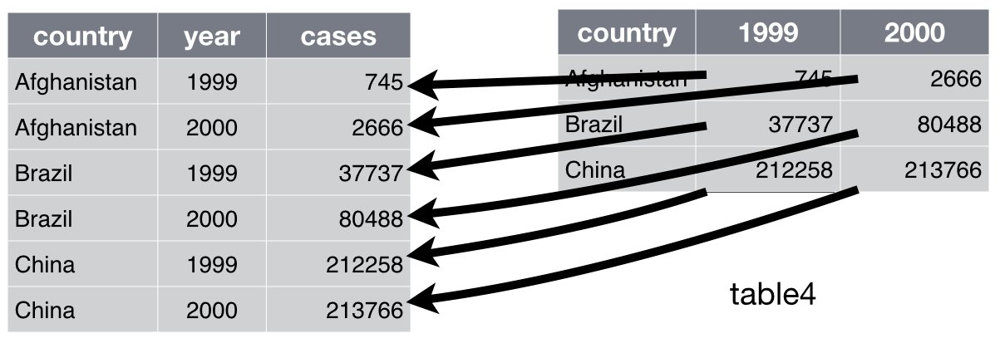
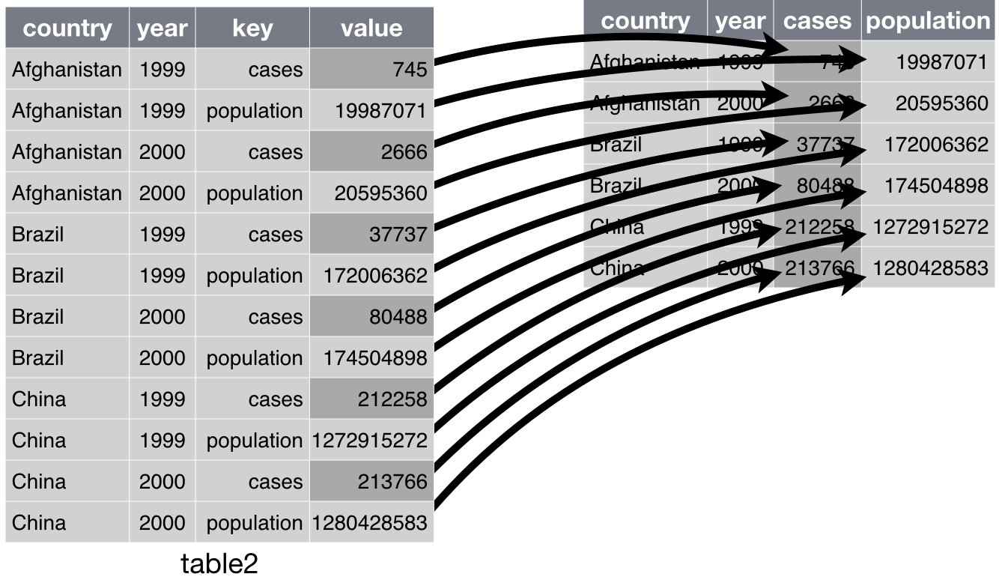
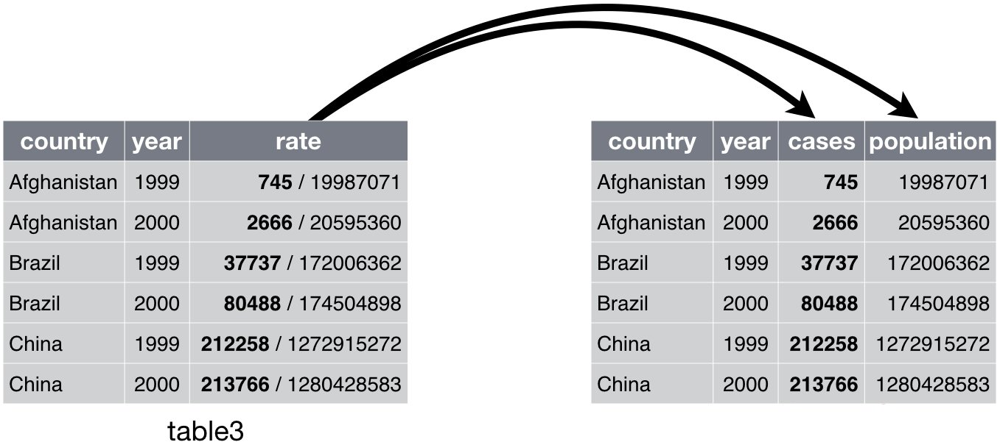

Tidy
========================================================
author: Wim van der Ham
width: 1440
height: 900

Tidy Data
========================================================

1. Each variable is in a column
1. Each observation is a row
1. Each value is a cell

tidy package
========================================================

1. `pivot_longer()` (formerly `gather()`) Collapse multiple columns into key-value pairs
1. `pivot_wider()`  (formerly `spread()`) Spread a key-value pair across multiple columns
1. `separate()` Split single column into multiple columns

pivot_longer
========================================================



pivot_longer - Arguments
========================================================


```r
df %>%
  pivot_longer(<columns>, names_to = "name", values_to = "value")
```

pivot_wider
========================================================



pivot_wider - Arguments
========================================================


```r
df %>%
  pivot_wider(names_from = <key column>, values_from = <value column>)
```

Separate
========================================================



Example - Load example dataset
========================================================


```r
who <- as_tibble(tidyr::who)
```

Example - Gather columns with treathments codes
========================================================


```r
who1 <- who %>% 
  pivot_longer(
    new_sp_m014:newrel_f65, names_to = "key", 
    values_to = "value", values_drop_na = TRUE
  )
who1
```

```
# A tibble: 76,046 x 6
   country     iso2  iso3   year key          value
   <chr>       <chr> <chr> <int> <chr>        <int>
 1 Afghanistan AF    AFG    1997 new_sp_m014      0
 2 Afghanistan AF    AFG    1997 new_sp_m1524    10
 3 Afghanistan AF    AFG    1997 new_sp_m2534     6
 4 Afghanistan AF    AFG    1997 new_sp_m3544     3
 5 Afghanistan AF    AFG    1997 new_sp_m4554     5
 6 Afghanistan AF    AFG    1997 new_sp_m5564     2
 7 Afghanistan AF    AFG    1997 new_sp_m65       0
 8 Afghanistan AF    AFG    1997 new_sp_f014      5
 9 Afghanistan AF    AFG    1997 new_sp_f1524    38
10 Afghanistan AF    AFG    1997 new_sp_f2534    36
# … with 76,036 more rows
```

Example - Count them to check keys
========================================================


```r
who1 %>% 
  group_by(key) %>%
  summarise(n = n())
```

```
# A tibble: 56 x 2
   key              n
   <chr>        <int>
 1 new_ep_f014   1032
 2 new_ep_f1524  1021
 3 new_ep_f2534  1021
 4 new_ep_f3544  1021
 5 new_ep_f4554  1017
 6 new_ep_f5564  1017
 7 new_ep_f65    1014
 8 new_ep_m014   1038
 9 new_ep_m1524  1026
10 new_ep_m2534  1020
# … with 46 more rows
```

Example - Fix typo in key
========================================================


```r
who2 <- who1 %>% 
  mutate(key = str_replace(key, "newrel", "new_rel"))
who2
```

```
# A tibble: 76,046 x 6
   country     iso2  iso3   year key          value
   <chr>       <chr> <chr> <int> <chr>        <int>
 1 Afghanistan AF    AFG    1997 new_sp_m014      0
 2 Afghanistan AF    AFG    1997 new_sp_m1524    10
 3 Afghanistan AF    AFG    1997 new_sp_m2534     6
 4 Afghanistan AF    AFG    1997 new_sp_m3544     3
 5 Afghanistan AF    AFG    1997 new_sp_m4554     5
 6 Afghanistan AF    AFG    1997 new_sp_m5564     2
 7 Afghanistan AF    AFG    1997 new_sp_m65       0
 8 Afghanistan AF    AFG    1997 new_sp_f014      5
 9 Afghanistan AF    AFG    1997 new_sp_f1524    38
10 Afghanistan AF    AFG    1997 new_sp_f2534    36
# … with 76,036 more rows
```

Example - Check if fixed
========================================================


```r
who2 %>% 
  count(key)
```

```
# A tibble: 56 x 2
   key              n
   <chr>        <int>
 1 new_ep_f014   1032
 2 new_ep_f1524  1021
 3 new_ep_f2534  1021
 4 new_ep_f3544  1021
 5 new_ep_f4554  1017
 6 new_ep_f5564  1017
 7 new_ep_f65    1014
 8 new_ep_m014   1038
 9 new_ep_m1524  1026
10 new_ep_m2534  1020
# … with 46 more rows
```

Example - Seperate the key value into columns
========================================================


```r
who3 <- who2 %>% 
  separate(key, c("new", "type", "sexage"), sep = "_")
who3
```

```
# A tibble: 76,046 x 8
   country     iso2  iso3   year new   type  sexage value
   <chr>       <chr> <chr> <int> <chr> <chr> <chr>  <int>
 1 Afghanistan AF    AFG    1997 new   sp    m014       0
 2 Afghanistan AF    AFG    1997 new   sp    m1524     10
 3 Afghanistan AF    AFG    1997 new   sp    m2534      6
 4 Afghanistan AF    AFG    1997 new   sp    m3544      3
 5 Afghanistan AF    AFG    1997 new   sp    m4554      5
 6 Afghanistan AF    AFG    1997 new   sp    m5564      2
 7 Afghanistan AF    AFG    1997 new   sp    m65        0
 8 Afghanistan AF    AFG    1997 new   sp    f014       5
 9 Afghanistan AF    AFG    1997 new   sp    f1524     38
10 Afghanistan AF    AFG    1997 new   sp    f2534     36
# … with 76,036 more rows
```

Example - Drop columns
========================================================


```r
who4 <- who3 %>% 
  select(-new, -iso2, -iso3)
who4
```

```
# A tibble: 76,046 x 5
   country      year type  sexage value
   <chr>       <int> <chr> <chr>  <int>
 1 Afghanistan  1997 sp    m014       0
 2 Afghanistan  1997 sp    m1524     10
 3 Afghanistan  1997 sp    m2534      6
 4 Afghanistan  1997 sp    m3544      3
 5 Afghanistan  1997 sp    m4554      5
 6 Afghanistan  1997 sp    m5564      2
 7 Afghanistan  1997 sp    m65        0
 8 Afghanistan  1997 sp    f014       5
 9 Afghanistan  1997 sp    f1524     38
10 Afghanistan  1997 sp    f2534     36
# … with 76,036 more rows
```

Example - Split sexage into sex and age
========================================================


```r
who5 <- who4 %>% 
  separate(sexage, c("sex", "age"), sep = 1)
who5
```

```
# A tibble: 76,046 x 6
   country      year type  sex   age   value
   <chr>       <int> <chr> <chr> <chr> <int>
 1 Afghanistan  1997 sp    m     014       0
 2 Afghanistan  1997 sp    m     1524     10
 3 Afghanistan  1997 sp    m     2534      6
 4 Afghanistan  1997 sp    m     3544      3
 5 Afghanistan  1997 sp    m     4554      5
 6 Afghanistan  1997 sp    m     5564      2
 7 Afghanistan  1997 sp    m     65        0
 8 Afghanistan  1997 sp    f     014       5
 9 Afghanistan  1997 sp    f     1524     38
10 Afghanistan  1997 sp    f     2534     36
# … with 76,036 more rows
```

Create Summaries for Multiple Columns
========================================================


```r
iris %>%
  pivot_longer(1:4, names_to = "key", values_to = "value") %>%
  group_by(Species, key) %>%
  summarise(
    mean_value = mean(value)
  )
```

```
# A tibble: 12 x 3
# Groups:   Species [3]
   Species    key          mean_value
   <fct>      <chr>             <dbl>
 1 setosa     Petal.Length      1.46 
 2 setosa     Petal.Width       0.246
 3 setosa     Sepal.Length      5.01 
 4 setosa     Sepal.Width       3.43 
 5 versicolor Petal.Length      4.26 
 6 versicolor Petal.Width       1.33 
 7 versicolor Sepal.Length      5.94 
 8 versicolor Sepal.Width       2.77 
 9 virginica  Petal.Length      5.55 
10 virginica  Petal.Width       2.03 
11 virginica  Sepal.Length      6.59 
12 virginica  Sepal.Width       2.97 
```

Strategy
========================================================

1. Calculate a summary value for 1 column
2. Gather all the columns you want to calculate the summary value for
3. Add the `key` value to the `group_by()` or add a `group_by` if there is none
4. Replace the column name in step 1 with `value`

Calculate for 1 column
========================================================


```r
iris %>%
  group_by(Species) %>%
  summarise(
    mean_value = mean(Petal.Length)
  )
```

```
# A tibble: 3 x 2
  Species    mean_value
  <fct>           <dbl>
1 setosa           1.46
2 versicolor       4.26
3 virginica        5.55
```

Gather Columns for Calculation
========================================================


```r
iris %>%
  pivot_longer(1:4, names_to = "key", values_to = "value")
```

```
# A tibble: 600 x 3
   Species key          value
   <fct>   <chr>        <dbl>
 1 setosa  Sepal.Length   5.1
 2 setosa  Sepal.Width    3.5
 3 setosa  Petal.Length   1.4
 4 setosa  Petal.Width    0.2
 5 setosa  Sepal.Length   4.9
 6 setosa  Sepal.Width    3  
 7 setosa  Petal.Length   1.4
 8 setosa  Petal.Width    0.2
 9 setosa  Sepal.Length   4.7
10 setosa  Sepal.Width    3.2
# … with 590 more rows
```

Create Summaries for Multiple Columns
========================================================


```r
iris %>%
  pivot_longer(1:4, names_to = "key", values_to = "value") %>%
  group_by(Species, key) %>%
  summarise(
    mean_value = mean(value)
  )
```

```
# A tibble: 12 x 3
# Groups:   Species [3]
   Species    key          mean_value
   <fct>      <chr>             <dbl>
 1 setosa     Petal.Length      1.46 
 2 setosa     Petal.Width       0.246
 3 setosa     Sepal.Length      5.01 
 4 setosa     Sepal.Width       3.43 
 5 versicolor Petal.Length      4.26 
 6 versicolor Petal.Width       1.33 
 7 versicolor Sepal.Length      5.94 
 8 versicolor Sepal.Width       2.77 
 9 virginica  Petal.Length      5.55 
10 virginica  Petal.Width       2.03 
11 virginica  Sepal.Length      6.59 
12 virginica  Sepal.Width       2.97 
```
