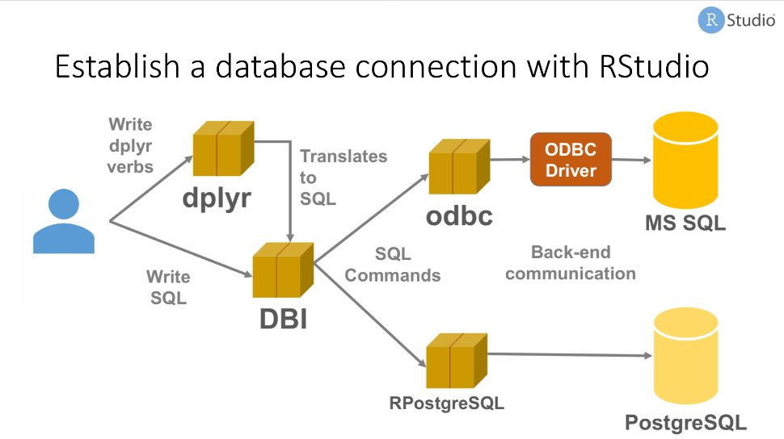
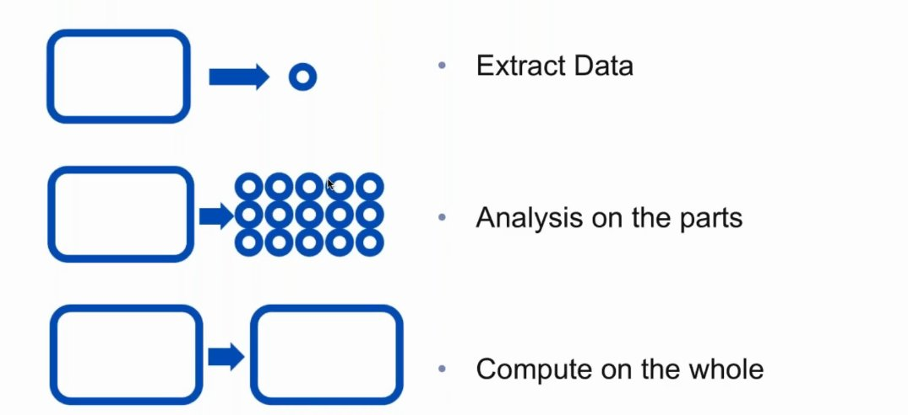

Reading Data
========================================================
author: Wim van der Ham
autosize: true

Reading Data from File
========================================================

- `read_csv()` reads comma delimited files 
- `read_csv2()` reads semicolon separated files (common in countries where , is used as the decimal place) 
- `read_tsv()` reads tab delimited files
- `read_delim()` reads files with any delimiter

stringsAsFactors
========================================================

- Old reading functions have a `.` between words
- They by default convert `strings` to `factors` because of old R memory usage


```r
paris_paintings_old <- read.csv(
  "./datasets/paris_paintings.csv", 
  stringsAsFactors = FALSE
)
paris_paintings_tv <- read_csv(
  "./datasets/paris_paintings.csv"
)
```

Write Data to File
========================================================

- `write_csv()` writes comma delimited files 
- `write_tsv()` writes tab delimited files
- `write_delim()` writes files with any delimiter

Reading and Writing to a R Data File
========================================================

> Faster and more consistend way of storing objects that are only used in R 

`read_rds()`

`write_rds()`

Reading from Excel Files
========================================================

- Functions are in the [readxl](http://readxl.tidyverse.org/) package
- `read_excel()` function for reading the excel file
- `excel_sheets()` function for getting all the sheets

Reading from Other Statistical Packages
========================================================

Functions are in the [haven](http://haven.tidyverse.org/) package

Using Rstudio
========================================================

The Import Dataset will open a window where you can graphically read and check your data. In the bottom right of the window the R command will be shown that can be coppied to your script.

Reading from Databases
========================================================



Connection Pane in Rstudio v1.1
========================================================

- View databases, schemas, tables and fields
- Explore data in tables or views
- Remembers connections you have made

Type of Problems
========================================================



Doing Calculations using the Database
========================================================

- Use `dplyr` to make data transformation commands
- `compute()` stores the data in a remote temporary table
- `collect()` retrieves data into a local data frame

Making Graphics using the Database
========================================================

Using [dbplot](https://rviews.rstudio.com/2017/08/16/visualizations-with-r-and-databases/)

- Only plot summaries
- Make this summaries on the database

Connecting to Mongo
========================================================

Using [mongolite](https://jeroen.github.io/mongolite/)

Create your own Data
========================================================

Using `tibble()` you can create your own data. This can be usefull when you want to try something on a smaller and artificial data set.

Some functions that are usefull in combination with `tibble()` are:

- `c()` for creating a vector
- `rep()` for repeating a vector
- `seq()` for creating a sequence
- `sample()` for generating random numbers

Create your own Data - Example
========================================================


```r
tibble(
  colors = c("red", "yellow", "green", "blue", "black", "white"),
  rep_int = rep(c(1, 2), 3),
  seq_int = seq(3, 8),
  random = sample(c(1, 2), 6, replace = TRUE)
)
```

```
# A tibble: 6 x 4
  colors rep_int seq_int random
  <chr>    <dbl>   <int>  <dbl>
1 red          1       3      2
2 yellow       2       4      2
3 green        1       5      2
4 blue         2       6      2
5 black        1       7      1
6 white        2       8      1
```
