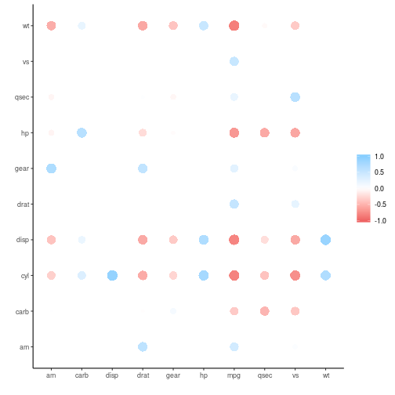
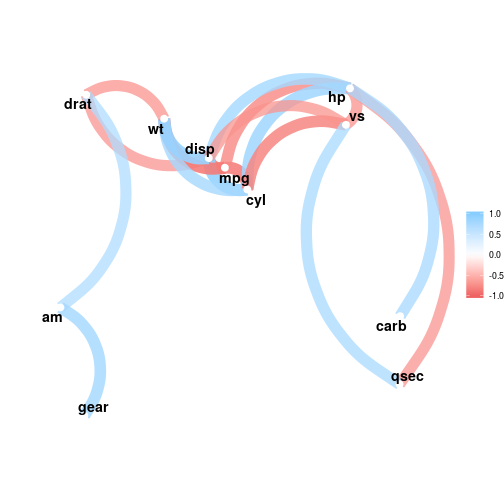
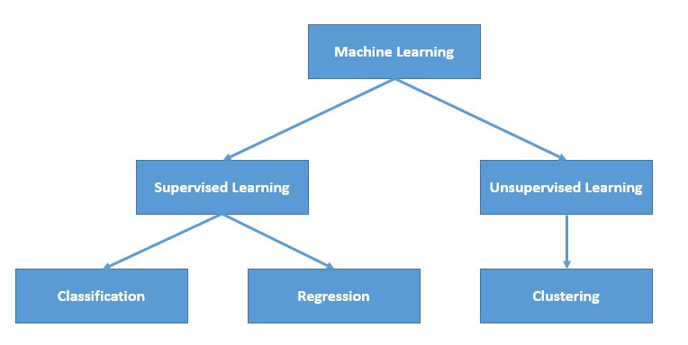
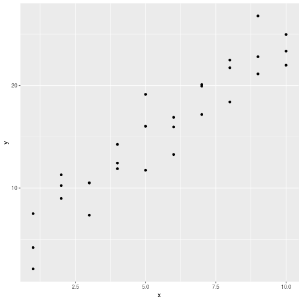

Modeling
========================================================
author: Wim van der Ham
width: 1440
height: 900

corrr package
========================================================


```r
mtcars %>%
  correlate()
```

```
# A tibble: 11 x 12
   rowname    mpg    cyl   disp     hp    drat     wt    qsec     vs
   <chr>    <dbl>  <dbl>  <dbl>  <dbl>   <dbl>  <dbl>   <dbl>  <dbl>
 1 mpg     NA     -0.852 -0.848 -0.776  0.681  -0.868  0.419   0.664
 2 cyl     -0.852 NA      0.902  0.832 -0.700   0.782 -0.591  -0.811
 3 disp    -0.848  0.902 NA      0.791 -0.710   0.888 -0.434  -0.710
 4 hp      -0.776  0.832  0.791 NA     -0.449   0.659 -0.708  -0.723
 5 drat     0.681 -0.700 -0.710 -0.449 NA      -0.712  0.0912  0.440
 6 wt      -0.868  0.782  0.888  0.659 -0.712  NA     -0.175  -0.555
 7 qsec     0.419 -0.591 -0.434 -0.708  0.0912 -0.175 NA       0.745
 8 vs       0.664 -0.811 -0.710 -0.723  0.440  -0.555  0.745  NA    
 9 am       0.600 -0.523 -0.591 -0.243  0.713  -0.692 -0.230   0.168
10 gear     0.480 -0.493 -0.556 -0.126  0.700  -0.583 -0.213   0.206
11 carb    -0.551  0.527  0.395  0.750 -0.0908  0.428 -0.656  -0.570
# … with 3 more variables: am <dbl>, gear <dbl>, carb <dbl>
```

rearrange()
========================================================


```r
mtcars %>%
  correlate() %>%
  rearrange()
```

```
# A tibble: 11 x 12
   rowname    mpg     vs    drat      am   gear    qsec    carb     hp
   <chr>    <dbl>  <dbl>   <dbl>   <dbl>  <dbl>   <dbl>   <dbl>  <dbl>
 1 mpg     NA      0.664  0.681   0.600   0.480  0.419  -0.551  -0.776
 2 vs       0.664 NA      0.440   0.168   0.206  0.745  -0.570  -0.723
 3 drat     0.681  0.440 NA       0.713   0.700  0.0912 -0.0908 -0.449
 4 am       0.600  0.168  0.713  NA       0.794 -0.230   0.0575 -0.243
 5 gear     0.480  0.206  0.700   0.794  NA     -0.213   0.274  -0.126
 6 qsec     0.419  0.745  0.0912 -0.230  -0.213 NA      -0.656  -0.708
 7 carb    -0.551 -0.570 -0.0908  0.0575  0.274 -0.656  NA       0.750
 8 hp      -0.776 -0.723 -0.449  -0.243  -0.126 -0.708   0.750  NA    
 9 wt      -0.868 -0.555 -0.712  -0.692  -0.583 -0.175   0.428   0.659
10 disp    -0.848 -0.710 -0.710  -0.591  -0.556 -0.434   0.395   0.791
11 cyl     -0.852 -0.811 -0.700  -0.523  -0.493 -0.591   0.527   0.832
# … with 3 more variables: wt <dbl>, disp <dbl>, cyl <dbl>
```

shave()
========================================================


```r
mtcars %>%
  correlate() %>%
  rearrange() %>%
  shave()
```

```
# A tibble: 11 x 12
   rowname    mpg     vs    drat      am   gear   qsec   carb     hp     wt
   <chr>    <dbl>  <dbl>   <dbl>   <dbl>  <dbl>  <dbl>  <dbl>  <dbl>  <dbl>
 1 mpg     NA     NA     NA      NA      NA     NA     NA     NA     NA    
 2 vs       0.664 NA     NA      NA      NA     NA     NA     NA     NA    
 3 drat     0.681  0.440 NA      NA      NA     NA     NA     NA     NA    
 4 am       0.600  0.168  0.713  NA      NA     NA     NA     NA     NA    
 5 gear     0.480  0.206  0.700   0.794  NA     NA     NA     NA     NA    
 6 qsec     0.419  0.745  0.0912 -0.230  -0.213 NA     NA     NA     NA    
 7 carb    -0.551 -0.570 -0.0908  0.0575  0.274 -0.656 NA     NA     NA    
 8 hp      -0.776 -0.723 -0.449  -0.243  -0.126 -0.708  0.750 NA     NA    
 9 wt      -0.868 -0.555 -0.712  -0.692  -0.583 -0.175  0.428  0.659 NA    
10 disp    -0.848 -0.710 -0.710  -0.591  -0.556 -0.434  0.395  0.791  0.888
11 cyl     -0.852 -0.811 -0.700  -0.523  -0.493 -0.591  0.527  0.832  0.782
# … with 2 more variables: disp <dbl>, cyl <dbl>
```

rplot()
========================================================


```r
mtcars %>%
  correlate() %>%
  rearrange() %>%
  shave() %>%
  rplot()
```



network_plot()
========================================================


```r
mtcars %>%
  correlate() %>%
  network_plot(min_cor = 0.7)
```



Overview
========================================================



Check with the Eye
========================================================



Linear Regression
========================================================

- Supervised learning
- Predicting a quantitative response
- Uses Least Squares to get the coefficients

Formula:

$y = β_0 + β_1 * x_1 + β_2 * x_2 + . . . + β_p * x_p$

In R: `lm()`

Alternatives
========================================================

In the `ML` chapter alternative models are discussed. 

Make Model
========================================================


```r
sim1_fit <- lm(y ~ x, data = sim1)
```

Check Model Using Summary
========================================================

Its complicated...


```

Call:
lm(formula = y ~ x, data = sim1)

Residuals:
    Min      1Q  Median      3Q     Max 
-4.1469 -1.5197  0.1331  1.4670  4.6516 

Coefficients:
            Estimate Std. Error t value Pr(>|t|)    
(Intercept)   4.2208     0.8688   4.858 4.09e-05 ***
x             2.0515     0.1400  14.651 1.17e-14 ***
---
Signif. codes:  0 '***' 0.001 '**' 0.01 '*' 0.05 '.' 0.1 ' ' 1

Residual standard error: 2.203 on 28 degrees of freedom
Multiple R-squared:  0.8846,	Adjusted R-squared:  0.8805 
F-statistic: 214.7 on 1 and 28 DF,  p-value: 1.173e-14
```

Create training and test set
========================================================


```r
train <- sim1 %>% 
  sample_frac(.75)
test <- sim1 %>%
  anti_join(train)
```

Fit the model on the training set
========================================================


```r
sim1_fit <- lm(y ~ x, data = train)
sim1_fit
```

```

Call:
lm(formula = y ~ x, data = train)

Coefficients:
(Intercept)            x  
      5.194        1.950  
```

Use the fit to make prediction on the test set
========================================================


```r
test <- test %>%
  mutate(pred = predict(sim1_fit, newdata = test))
test
```

```
# A tibble: 8 x 3
      x     y  pred
  <int> <dbl> <dbl>
1     1  2.13  7.14
2     2 11.3   9.09
3     3  7.36 11.0 
4     4 11.9  13.0 
5     5 11.7  14.9 
6     6 16.0  16.9 
7     8 18.4  20.8 
8     8 22.5  20.8 
```

Measure the score
========================================================


```r
test %>%
  mutate(resid = pred - y) %>%
  mutate(resid_2 = resid^2) %>%
  summarise(rmse = sum(resid_2, na.rm = TRUE))
```

```
# A tibble: 1 x 1
   rmse
  <dbl>
1  64.6
```

Set Reference Group
========================================================

By default the `lm()` function sets the first group of a factor to the reference group, and compares the difference of the other groups with this first one. Using the function `relevel()` you can change this in the following way:


```r
groups <- factor(c("A", "B", "C"))
groups
```

```
[1] A B C
Levels: A B C
```

```r
groups_releveled <- relevel(groups, ref = "B")
groups_releveled
```

```
[1] A B C
Levels: B A C
```

**Note** this will not change the final predictions you make with the model. It will only allow you to see more easily differences related to a specific group.
