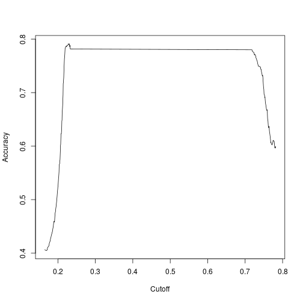

Logistic Regression
========================================================
author: Wim van der Ham
autosize: true

Overview
========================================================


Logistic Regression
========================================================

- Supervised learning
- Predicting a binary response
- Maximum Likelihood

Formula:


In R: `glm(..., family = "binomial")`

Logistic Regression vs Linear Regression
========================================================


- Easier to interpret as a probability
- Can be extended to qualitative responses with more than two levels

Explore with Graphics
========================================================


Make the Model
========================================================


```r
model_sex <- glm(
  Survived ~ Sex, 
  train, family = "binomial"
) 
```

Check Model Using Summary
========================================================


```

Call:
glm(formula = Survived ~ Sex, family = "binomial", data = train)

Deviance Residuals: 
    Min       1Q   Median       3Q      Max  
-1.6462  -0.6471  -0.6471   0.7725   1.8256  

Coefficients:
            Estimate Std. Error z value Pr(>|z|)    
(Intercept)   1.0566     0.1290   8.191 2.58e-16 ***
Sexmale      -2.5137     0.1672 -15.036  < 2e-16 ***
---
Signif. codes:  0 '***' 0.001 '**' 0.01 '*' 0.05 '.' 0.1 ' ' 1

(Dispersion parameter for binomial family taken to be 1)

    Null deviance: 1186.7  on 890  degrees of freedom
Residual deviance:  917.8  on 889  degrees of freedom
AIC: 921.8

Number of Fisher Scoring iterations: 4
```

Check Model Using Summary Coefficients
========================================================

**Call** the call used to create the model

**Residuals** description of the distribution of the residuals, median should be close to 0, 1Q and 3Q should be more or less the same

**Estimate** the estimated values for the coefficients

**Std. Error** the standard error, can be used to calculate confidence intervals for the estimates

**t value** the t-statistic, a measure of the number of sd the estimate is away from 0

**Pr(>|t|)** the p-value for the t-test

Calculate Probabilities
========================================================


```r
exp(1) / (1 + exp(1))
```

```
[1] 0.7310586
```

```r
exp(1 + -2.5) / (1 + exp(1 + -2.5))
```

```
[1] 0.1824255
```

<!-- Check Model Using Summary Coefficients -->
<!-- ======================================================== -->

<!-- **Null deviance** how well the Null model fits the data -->

<!-- **Residual deviance** how well the proposed model fits the data -->

<!-- ```{r} -->
<!-- p_value <- pchisq( -->
<!--   1186.7 - 917.8, 1,  -->
<!--   lower.tail = FALSE -->
<!-- ) -->
<!-- p_value -->
<!-- ``` -->

Odds Ratios and Confidence Intervals
========================================================


```r
or_ci <- exp(cbind(
  OR = coef(model_sex), confint(model_sex)
)) %>%
  as_tibble(rownames = "estimates")
or_ci
```

```
# A tibble: 2 x 4
  estimates       OR `2.5 %` `97.5 %`
  <chr>        <dbl>   <dbl>    <dbl>
1 (Intercept) 2.88    2.24      3.72 
2 Sexmale     0.0810  0.0580    0.112
```

Odds Ratios and Confidence Intervals
========================================================

**Odds Ratio** defined as the ratio of the odds of A in the presence of B and the odds of A without the presence of B. If much bigger or smaller than 1 A is considered associated with B.

The odds ratio for survival between men and women is 0.0809673

Use Model to make Predictions
========================================================


```r
train <- train %>%
  mutate(
    prob = predict(
      model_sex, train,
      type = "response"
    ),
    pred = ifelse(
      prob > 0.5, 
      1, 
      0
    )
  )
```

Confusion Matrix 
========================================================


```r
table(train$Survived, train$pred)
```

```
   
      0   1
  0 468  81
  1 109 233
```

Accuracy, Precision and Recall
========================================================


```r
# Accuracy
sum(train$pred == train$Survived) / nrow(train)
```

```
[1] 0.7867565
```

```r
# Precision
sum(train$pred == 1 & train$Survived == 1) / sum(train$pred == 1)
```

```
[1] 0.7420382
```

```r
# Recall
sum(train$pred == 1 & train$Survived == 1) / sum(train$Survived == 1)
```

```
[1] 0.6812865
```

ROC curve
========================================================

> The ROC curve is created by plotting the true positive rate (TPR) against the false positive rate (FPR)

This is usefull for comparing the overall performance of a model, sum-
marized over all possible thresholds

ROC curve - Model Sex
========================================================


ROC curve - Model Age & Sex
========================================================


Accuracy for Different Cutoff values
========================================================



Exercise
========================================================

Try to improve the example model by adding more factors
