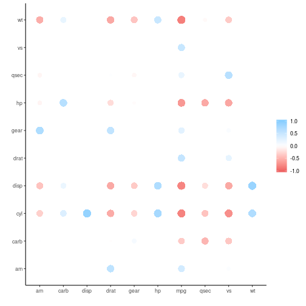
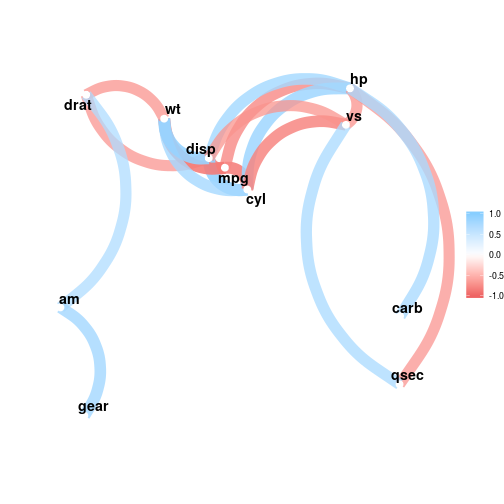

Modeling
========================================================
author: Wim van der Ham
width: 1440
height: 900

corrr package
========================================================


```r
mtcars %>%
  correlate()
```

```
# A tibble: 11 x 12
   rowname     mpg     cyl    disp      hp     drat      wt     qsec
   <chr>     <dbl>   <dbl>   <dbl>   <dbl>    <dbl>   <dbl>    <dbl>
 1 mpg      NA      -0.852  -0.848  -0.776   0.681   -0.868   0.419 
 2 cyl      -0.852  NA       0.902   0.832  -0.700    0.782  -0.591 
 3 disp     -0.848   0.902  NA       0.791  -0.710    0.888  -0.434 
 4 hp       -0.776   0.832   0.791  NA      -0.449    0.659  -0.708 
 5 drat      0.681  -0.700  -0.710  -0.449  NA       -0.712   0.0912
 6 wt       -0.868   0.782   0.888   0.659  -0.712   NA      -0.175 
 7 qsec      0.419  -0.591  -0.434  -0.708   0.0912  -0.175  NA     
 8 vs        0.664  -0.811  -0.710  -0.723   0.440   -0.555   0.745 
 9 am        0.600  -0.523  -0.591  -0.243   0.713   -0.692  -0.230 
10 gear      0.480  -0.493  -0.556  -0.126   0.700   -0.583  -0.213 
11 carb     -0.551   0.527   0.395   0.750  -0.0908   0.428  -0.656 
# … with 4 more variables: vs <dbl>, am <dbl>, gear <dbl>, carb <dbl>
```

rearrange()
========================================================


```r
mtcars %>%
  correlate() %>%
  rearrange()
```

```
# A tibble: 11 x 12
   rowname     mpg      vs     drat       am    gear     qsec     carb
   <chr>     <dbl>   <dbl>    <dbl>    <dbl>   <dbl>    <dbl>    <dbl>
 1 mpg      NA       0.664   0.681    0.600    0.480   0.419   -0.551 
 2 vs        0.664  NA       0.440    0.168    0.206   0.745   -0.570 
 3 drat      0.681   0.440  NA        0.713    0.700   0.0912  -0.0908
 4 am        0.600   0.168   0.713   NA        0.794  -0.230    0.0575
 5 gear      0.480   0.206   0.700    0.794   NA      -0.213    0.274 
 6 qsec      0.419   0.745   0.0912  -0.230   -0.213  NA       -0.656 
 7 carb     -0.551  -0.570  -0.0908   0.0575   0.274  -0.656   NA     
 8 hp       -0.776  -0.723  -0.449   -0.243   -0.126  -0.708    0.750 
 9 wt       -0.868  -0.555  -0.712   -0.692   -0.583  -0.175    0.428 
10 disp     -0.848  -0.710  -0.710   -0.591   -0.556  -0.434    0.395 
11 cyl      -0.852  -0.811  -0.700   -0.523   -0.493  -0.591    0.527 
# … with 4 more variables: hp <dbl>, wt <dbl>, disp <dbl>, cyl <dbl>
```

shave()
========================================================


```r
mtcars %>%
  correlate() %>%
  rearrange() %>%
  shave()
```

```
# A tibble: 11 x 12
   rowname     mpg      vs     drat       am    gear    qsec   carb     hp
   <chr>     <dbl>   <dbl>    <dbl>    <dbl>   <dbl>   <dbl>  <dbl>  <dbl>
 1 mpg      NA      NA      NA       NA       NA      NA     NA     NA    
 2 vs        0.664  NA      NA       NA       NA      NA     NA     NA    
 3 drat      0.681   0.440  NA       NA       NA      NA     NA     NA    
 4 am        0.600   0.168   0.713   NA       NA      NA     NA     NA    
 5 gear      0.480   0.206   0.700    0.794   NA      NA     NA     NA    
 6 qsec      0.419   0.745   0.0912  -0.230   -0.213  NA     NA     NA    
 7 carb     -0.551  -0.570  -0.0908   0.0575   0.274  -0.656 NA     NA    
 8 hp       -0.776  -0.723  -0.449   -0.243   -0.126  -0.708  0.750 NA    
 9 wt       -0.868  -0.555  -0.712   -0.692   -0.583  -0.175  0.428  0.659
10 disp     -0.848  -0.710  -0.710   -0.591   -0.556  -0.434  0.395  0.791
11 cyl      -0.852  -0.811  -0.700   -0.523   -0.493  -0.591  0.527  0.832
# … with 3 more variables: wt <dbl>, disp <dbl>, cyl <dbl>
```

rplot()
========================================================


```r
mtcars %>%
  correlate() %>%
  rearrange() %>%
  shave() %>%
  rplot()
```



network_plot()
========================================================


```r
mtcars %>%
  correlate() %>%
  network_plot(min_cor = 0.7)
```


