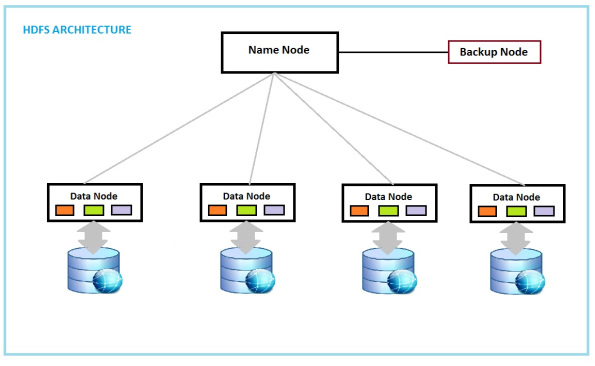
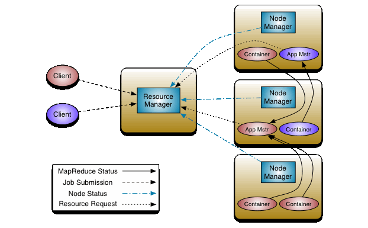
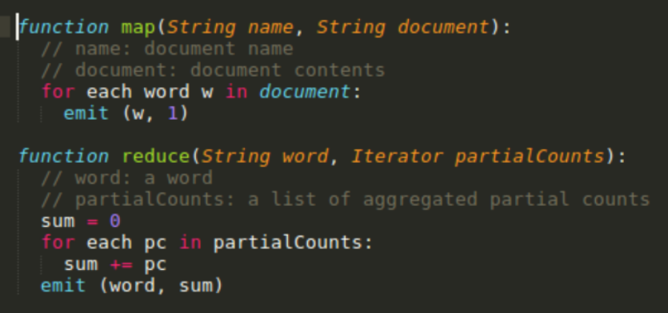
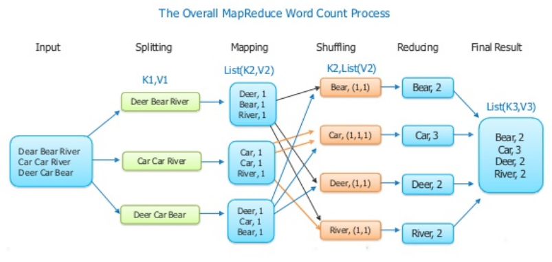
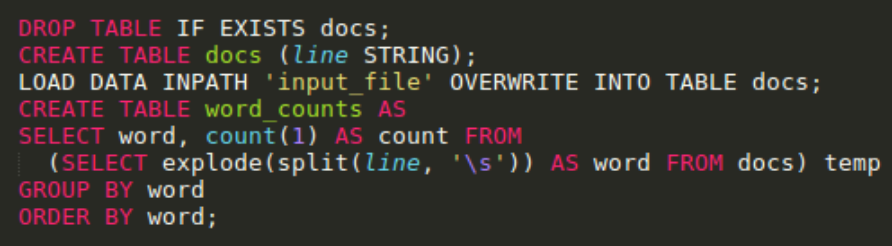

Hadoop & Spark
========================================================
author: Wim van der Ham
date: 2018-06-29
autosize: true

What is Hadoop?
========================================================

> Hadoop (2008) is an open-source software framework for storing data and running applications on clusters of commodity hardware. It provides massive storage for any kind of data, enormous processing power and the ability to handle virtually limitless concurrent tasks or jobs.

Projects
========================================================

* [Hadoop Distributed File System (HDFS™)](https://hadoop.apache.org/docs/current/) File system to store date in a distributed way
* [YARN](https://hadoop.apache.org/docs/current/) A framework for job scheduling and cluster resource management
* [Hadoop MapReduce](https://hadoop.apache.org/docs/current/) A YARN-based system for parallel processing of large data sets
* [Spark](https://spark.apache.org/) A fast and general compute engine for Hadoop data
* [Hive](https://hive.apache.org/)  A data warehouse infrastructure that provides data summarization and ad hoc querying

Hadoop Distributed File System (HDFS™)
========================================================

* **Fault tolerance** Protected against hardware failure
* **Distributed** No central place where all the data is but multiple nodes
* **Scalable** When more computing power or storage is needed, more nodes can be added
* **Flexibility** No data per-processing is required

History
========================================================

**Before Hadoop**

* 1 computer has all the data and computing power
* When you collect more data you need a bigger, more *expensive*, computer
* When your computer breaks down you lose your data

***

**After Hadoop**

* Multiple computers have all the data and computing power and communicate with each other
* When you collect more data you need to add more *cheap* computers
* When a computer breaks down you data is still available on another computer

HDFS Architecture
========================================================

YARN Architecture
========================================================

Yet Another Resource Negotiator

Versions of Hadoop
========================================================

**Hadoop 1 --> Hadoop 2**

 * YARN

***

**Hadoop 2 --> Hadoop 3**

* Multiple name nodes, which solves the single point of failure problem
* Permits usage of GPU hardware within the cluster, which is a very substantial benefit to execute Deep Learning algorithms

MapReduce Programming Model
========================================================

MapReduce Programming Model Example
========================================================

Hadoop MapReduce
========================================================

> Implementation of this model using JAVA in the Hadoop environment

Apache Spark
========================================================

> Apache Spark™ (2012) is a unified analytics engine for large-scale data processing

MapReduce vs Spark
========================================================

**MapReduce**

* Low level
* No interactive mode, only batch
* Writes results constantly to the hard disk (*slow*)
* Implemented in `JAVA`

***

**Spark**

* Higher level [MLlib](https://spark.apache.org/mllib/)
* Has an interactive mode
* Keeps results in memory (*fast*)
* Implemented in `scala` and offers nice API's to `R`, `python` and `JAVA`

Apache Hive
========================================================

> The Apache Hive™ (2010) data warehouse software facilitates reading, writing, and managing large datasets residing in distributed storage using SQL.

Apache Hive - Example
========================================================

