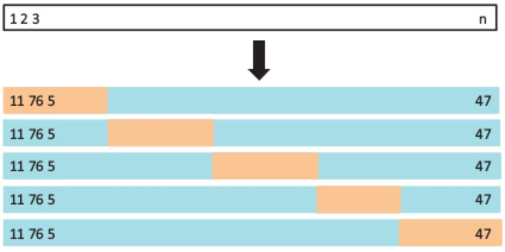

Resampling
========================================================
author: Wim van der Ham
autosize: true

Resampling
========================================================

> Evaluate the model performance on a different set than the set used to train the model. This way the performance of the model with new data can be determined.

1. Cross-Validation
1. Bootstrap

The Validation Set Approach
========================================================

> Randomly dividing the available set of observations into two parts, a training set and a validation set. The model is fit on the training set, and the fitted model is used on the validation set.

The Validation Set Approach
========================================================


The Validation Set Approach
========================================================

Disadvantages:

1. **Highly variable** score depends a lot on which points ar in the test or in the validation group
2. **Overestimates the test error** because only half of the data is used for training

Leave-One-Out Cross-Validation
========================================================

> Repeatedly train model on all but one observation. Test on the one observation left out.

Leave-One-Out Cross-Validation
========================================================


Leave-One-Out Cross-Validation
========================================================

Advantages:

1. **Low variability** every step you almost use all the data for training
1. **No randomness** every time this method is used the outcome is the same

***

Disadvantages:

1. **Computational expensive** the model has to be fitted *n* times which can be computational expensive (for a linear model this is not the case)

k-Fold Cross-Validation
========================================================

> Divide the data into *k* groups. Repeatedly train on all but one group and test on the group left out.

k-Fold Cross-Validation
========================================================



k-Fold Cross-Validation
========================================================

Advantages:

1. **Better estimate of score** because it is less prone to over fitting
1. **Computational less expensive** you need to fit the model *k* times

Empirically *k* = 5 or *k* = 10 show the best results

Bootstrap
========================================================

> Repeatedly sample your sample with replacement. To quantify the uncertainty of an estimator.


```r
sample(1:10, 10, replace = TRUE)
```

```
 [1] 7 6 1 9 7 2 7 2 3 7
```

Example
========================================================

Examples can be found in the `resample.R` file.

Exercise
========================================================

1. Use CV to determine the number of polynomials that should be used the predict the `arr_del` using the `dep_delay` with the `flights` dataset

1. An exercise can be found in the `bootstrap.Rmd` file.
