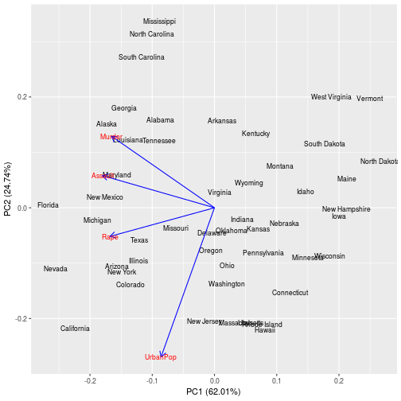
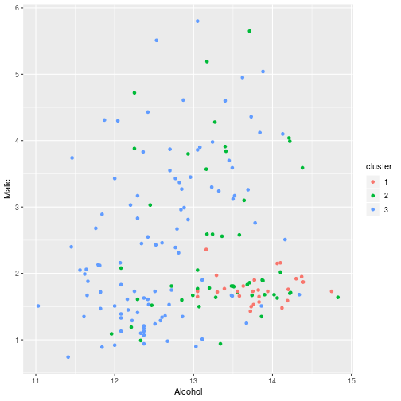
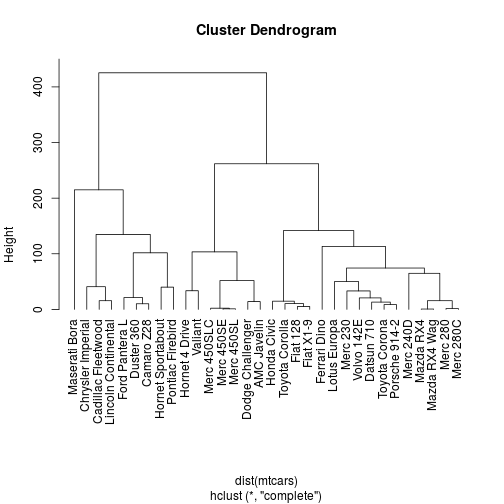

Unsupervised Learning
========================================================
author: Wim van der Ham
date: 2018-09-03
autosize: true

Overview
========================================================


Unsupervised Learning
========================================================

> Unsupervised learning is used when you do not want to predict anything but want to understand your data better. It is much harder than supervised learning because there is no simple goal.

It answers questions like:

- Is there an informative way to visualize the data? 
- Can we discover subgroups among the variables or among the observations?

Unsupervised Learning
========================================================

In this chapter we will discuss two different techniques:

1. [principal components analysis](https://en.wikipedia.org/wiki/Principal_component_analysis), a tool
used for data visualization or data pre-processing
1. [clustering](https://en.wikipedia.org/wiki/Cluster_analysis), a broad class of methods for discovering
unknown subgroups in data

PCA
========================================================

> Allows to summarize a data set with less variables that still explin most of the variation in the data

When the number of variables in the dataset is big it van be difficult to visualize the data. PCA reduces the number of variables while stil showing most of the variation in the data.

PCA - Example Graph
========================================================


PCA - USA Arrest Example
========================================================

Scaling and centering the variables around zero is required to calculate unbiased components


```r
pca <- prcomp(
  USArrests, 
  center = TRUE, 
  scale. = TRUE
)
```

Plotting the Result - Code
========================================================


```r
library(ggfortify)
autoplot(
  pca, shape = FALSE, 
  label.size = 3,
  loadings = TRUE, loadings.colour = 'blue',
  loadings.label = TRUE, 
  loadings.label.size = 3
)
```

Plotting the Result - Graph
========================================================



Clustering
========================================================

> Make groups of observations that are similar to each other

Here we will explain two methods:

1. [k-means clustering](https://en.wikipedia.org/wiki/K-means_clustering), devides the data in a pre-defined number of clusters
1. [Hierarchical clustering](https://en.wikipedia.org/wiki/Hierarchical_clustering), creates a dendrogram

k-means clustering
========================================================

1. Randomly assign every point to a cluster, the number of clusters is defined by the user
1. Repeat the next steps untill the centers are stable
  - Update the locations of the centers by taking the average of all assigned points
  - Assign each point to the closest (using the [Euclidean distance](https://en.wikipedia.org/wiki/Euclidean_distance)) center for that point

k-means clustering - Wine Example
========================================================  


```r
library(rattle)
kc <- kmeans(wine, 3)
kc
```

```
K-means clustering with 3 clusters of sizes 28, 50, 100

Cluster means:
  Type  Alcohol    Malic    Ash Alcalinity Magnesium  Phenols Flavanoids
1 1.00 13.82214 1.773929 2.4900   16.96429  105.3571 2.923929   3.111429
2 1.62 13.33680 2.396800 2.3718   18.51000  108.6000 2.432400   2.214800
3 2.36 12.60250 2.463600 2.3293   20.69600   93.7400 2.050400   1.633500
  Nonflavanoids Proanthocyanins    Color      Hue Dilution Proline
1     0.2985714        1.986786 6.202857 1.103571 2.984643 1301.50
2     0.3236000        1.707200 5.143600 0.966720 2.862800  894.60
3     0.3987000        1.421900 4.694800 0.911900 2.381700  517.75

Clustering vector:
  [1] 2 2 1 1 2 1 1 1 2 2 1 1 1 1 1 1 1 1 1 2 2 2 2 2 2 2 1 1 2 2 1 1 2 1 2
 [36] 2 2 1 2 2 2 2 2 3 2 2 2 2 2 1 1 1 1 1 2 1 2 1 1 3 3 3 3 3 3 3 3 3 2 2
 [71] 2 3 3 2 2 3 3 3 2 3 3 2 3 3 3 3 3 3 3 3 3 3 3 3 3 2 3 3 3 3 2 3 3 3 3
[106] 3 3 3 3 3 3 3 3 3 3 3 3 3 3 3 3 3 3 3 3 3 3 3 3 3 3 3 3 3 3 3 2 3 3 3
[141] 3 2 3 3 2 2 3 3 3 3 3 3 3 3 3 2 3 2 3 3 3 3 3 3 3 3 3 3 2 3 3 3 3 2 2
[176] 2 2 3

Within cluster sum of squares by cluster:
[1]  550201.0  815817.5 1263355.6
 (between_SS / total_SS =  85.1 %)

Available components:

[1] "cluster"      "centers"      "totss"        "withinss"    
[5] "tot.withinss" "betweenss"    "size"         "iter"        
[9] "ifault"      
```

Confusion Matrix
========================================================  


```r
table(wine$Type, kc$cluster)
```

```
   
     1  2  3
  1 28 30  1
  2  0  9 62
  3  0 11 37
```

Graph of Clusters
========================================================  


```r
wine %>%
  mutate(cluster = as.factor(kc$cluster)) %>%
  ggplot() +
  geom_point(
    aes(Alcohol, Malic, color = cluster)
  )
```



Dendogram mtcars example
========================================================


```r
# prepare hierarchical cluster
hc = hclust(dist(mtcars))
# very simple dendrogram
plot(hc, hang = -1)
```



Exercise
========================================================

1. Plot the first two principal components for the `iris` dataset and explain what for information you can get from this graph.
1. Try to cluster the `iris` dataset and check if it comes close to the actual `Species` label.
