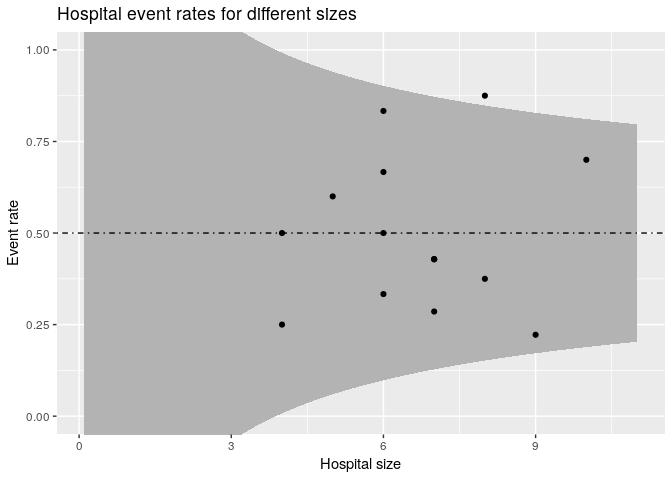

Funnel plot
================

A [funnel plot](https://en.wikipedia.org/wiki/Funnel_plot) is a plot
that shows how much a single observation is deviated from the total
mean. Also a confidence interval is show so you can see if the deviation
of an observation is significant. The confidence interval depends on the
number of observations.

# Dummy Data

First a sample data set is created. This example is about patients who
have some treatment in a hospital and after this treatment have an event
or not. Event can be complication death or something else depending on
the application.

``` r
df <- tibble(
  patient_id = 1:100,
  hospital_id = sample(15, 100, replace = TRUE),
  event = rep(0:1, 50)
)
df
```

    ## # A tibble: 100 x 3
    ##    patient_id hospital_id event
    ##         <int>       <int> <int>
    ##  1          1          14     0
    ##  2          2           7     1
    ##  3          3          10     0
    ##  4          4           8     1
    ##  5          5           8     0
    ##  6          6          11     1
    ##  7          7          11     0
    ##  8          8          15     1
    ##  9          9           4     0
    ## 10         10           8     1
    ## # ... with 90 more rows

From this data the total event ratio can be calculated like:

``` r
total_event_ratio <- mean(df$event)
total_event_ratio
```

    ## [1] 0.5

Besides the total event rate we also need to know the event rate per
hospital. So we can compare hospitals with each other an with the global
mean. We create a different data frame for this:

``` r
df_event_rate <- df %>%
  group_by(hospital_id) %>%
  summarise(
    total_patients = n(),
    total_events = sum(event)
  ) %>%
  mutate(event_rate = total_events / total_patients)
df_event_rate
```

    ## # A tibble: 15 x 4
    ##    hospital_id total_patients total_events event_rate
    ##          <int>          <int>        <int>      <dbl>
    ##  1           1              9            2      0.222
    ##  2           2              6            3      0.5  
    ##  3           3              4            1      0.25 
    ##  4           4              6            2      0.333
    ##  5           5              6            4      0.667
    ##  6           6              4            2      0.5  
    ##  7           7              5            3      0.6  
    ##  8           8              7            3      0.429
    ##  9           9              8            7      0.875
    ## 10          10              8            3      0.375
    ## 11          11              7            3      0.429
    ## 12          12              6            5      0.833
    ## 13          13             10            7      0.7  
    ## 14          14              7            2      0.286
    ## 15          15              7            3      0.429

Now we want to calculate the confidence intervals. First we specify the
range over which we calculate the confidence
intervals.

``` r
n_patients_seq <- seq(0.1, max(df_event_rate$total_patients) + 1, by = 0.1)
n_patients_seq
```

    ##   [1]  0.1  0.2  0.3  0.4  0.5  0.6  0.7  0.8  0.9  1.0  1.1  1.2  1.3  1.4
    ##  [15]  1.5  1.6  1.7  1.8  1.9  2.0  2.1  2.2  2.3  2.4  2.5  2.6  2.7  2.8
    ##  [29]  2.9  3.0  3.1  3.2  3.3  3.4  3.5  3.6  3.7  3.8  3.9  4.0  4.1  4.2
    ##  [43]  4.3  4.4  4.5  4.6  4.7  4.8  4.9  5.0  5.1  5.2  5.3  5.4  5.5  5.6
    ##  [57]  5.7  5.8  5.9  6.0  6.1  6.2  6.3  6.4  6.5  6.6  6.7  6.8  6.9  7.0
    ##  [71]  7.1  7.2  7.3  7.4  7.5  7.6  7.7  7.8  7.9  8.0  8.1  8.2  8.3  8.4
    ##  [85]  8.5  8.6  8.7  8.8  8.9  9.0  9.1  9.2  9.3  9.4  9.5  9.6  9.7  9.8
    ##  [99]  9.9 10.0 10.1 10.2 10.3 10.4 10.5 10.6 10.7 10.8 10.9 11.0

Using this range and using the
[formula](https://www.mathsisfun.com/data/confidence-interval.html) for
calculating confidence intervals we can make a new data frame:

``` r
df_conf <- tibble(
  n_patients = n_patients_seq,
  conf_upper = total_event_ratio + 1.96 * (sd(df$event) / sqrt(n_patients)),
  conf_lower = total_event_ratio - 1.96 * (sd(df$event) / sqrt(n_patients))
)
df_conf
```

    ## # A tibble: 110 x 3
    ##    n_patients conf_upper conf_lower
    ##         <dbl>      <dbl>      <dbl>
    ##  1        0.1       3.61     -2.61 
    ##  2        0.2       2.70     -1.70 
    ##  3        0.3       2.30     -1.30 
    ##  4        0.4       2.06     -1.06 
    ##  5        0.5       1.89     -0.893
    ##  6        0.6       1.77     -0.772
    ##  7        0.7       1.68     -0.677
    ##  8        0.8       1.60     -0.601
    ##  9        0.9       1.54     -0.538
    ## 10        1         1.48     -0.485
    ## # ... with 100 more rows

Combining all this into one graph with different layers gives us the
result we want.

``` r
ggplot() +
  geom_ribbon(aes(x = n_patients_seq, ymin = conf_lower, ymax = conf_upper), df_conf, fill = "grey70") +
  geom_hline(yintercept = total_event_ratio, linetype = 4) +
  geom_point(aes(total_patients, event_rate), df_event_rate) + 
  coord_cartesian(ylim = c(0, 1)) +
  labs(
    title = "Hospital event rates for different sizes",
    x = "Hospital size",
    y = "Event rate"
  )
```

<!-- -->
