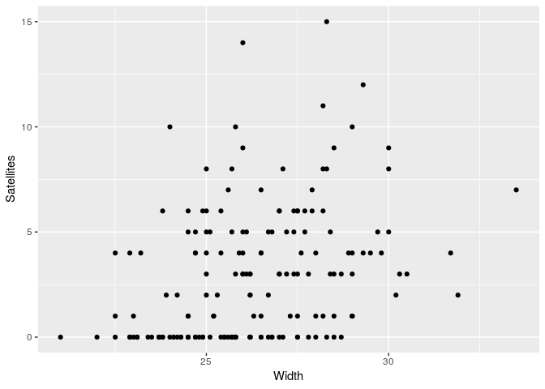
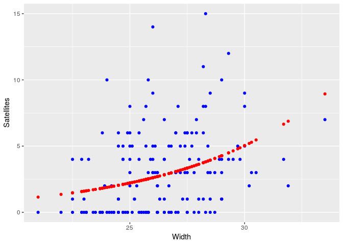

Poisson Distribution
================
Wim van der Ham
3/9/2018

# Calculating Probabilities

The [poisson
distribution](https://en.wikipedia.org/wiki/Poisson_distribution) is a
discrete probability distribution that expresses the probability of a
given number of events occurring in a fixed interval of time or space if
these events occur with a known constant rate and independently of the
time since the last event.

For example the number of goals during a soccer match. During the World
Cup of 2014 the average number of goals per game was 2,5. Using this
average and the poisson distribution you can calculate the probability
of exactly 2 goals in a match:

``` r
dpois(2, lambda = 2.5)
```

    ## [1] 0.2565156

Or calculate the probability of 1 or less goals:

``` r
ppois(1, lambda = 2.5)
```

    ## [1] 0.2872975

# Modeling

The poisson distribution can also be used to model. In the following
example the number of satellites depends on the width of the crab.

``` r
ggplot(crabs) +
  geom_point(aes(Width, Satellites))
```

<!-- -->

We can try to model this using the poisson distribution:

``` r
model = glm(Satellites ~ Width, crabs, family = poisson(link = log))
summary(model)
```

    ## 
    ## Call:
    ## glm(formula = Satellites ~ Width, family = poisson(link = log), 
    ##     data = crabs)
    ## 
    ## Deviance Residuals: 
    ##     Min       1Q   Median       3Q      Max  
    ## -2.8526  -1.9884  -0.4933   1.0970   4.9221  
    ## 
    ## Coefficients:
    ##             Estimate Std. Error z value Pr(>|z|)    
    ## (Intercept) -3.30476    0.54224  -6.095  1.1e-09 ***
    ## Width        0.16405    0.01997   8.216  < 2e-16 ***
    ## ---
    ## Signif. codes:  0 '***' 0.001 '**' 0.01 '*' 0.05 '.' 0.1 ' ' 1
    ## 
    ## (Dispersion parameter for poisson family taken to be 1)
    ## 
    ##     Null deviance: 632.79  on 172  degrees of freedom
    ## Residual deviance: 567.88  on 171  degrees of freedom
    ## AIC: 927.18
    ## 
    ## Number of Fisher Scoring iterations: 6

And check if the fit is good:

``` r
crabs <- crabs %>%
  mutate(fitted = model$fitted)

ggplot(crabs) +
  geom_point(aes(Width, Satellites), color="blue") +
  geom_point(aes(Width, fitted), color="red")
```

<!-- -->

Using the coefficient form the model we can calculate the number of
satellites for a specific height:

``` r
exp(-3.30 + 0.164 * 25)
```

    ## [1] 2.225541
