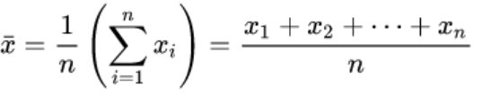
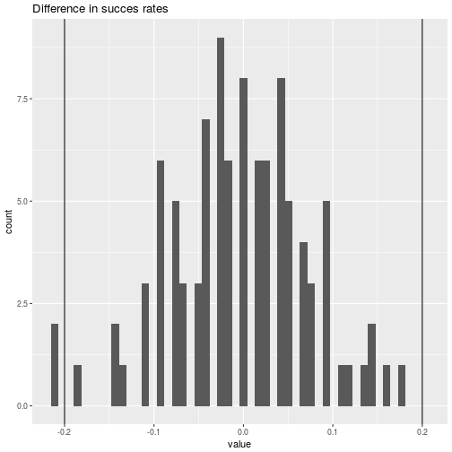
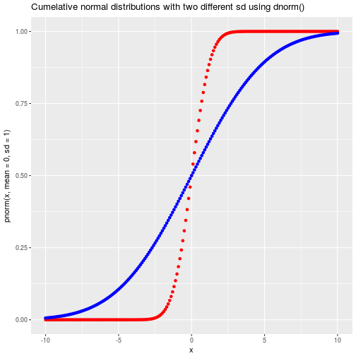

Introductory Statistics
========================================================
author: Wim van der Ham
date: 26/1/2018
autosize: true


Type of Data Collection
========================================================

Observational Study -> Association

Randomized Experiment -> Causation

Type of Variables
========================================================


Mean
========================================================

> The sample mean of a numerical variable is the sum of all of the observations
divided by the number of observations:



Mean - R
========================================================


```r
data_1 <- c(3, 5, 8, 9, 600)
data_2 <- c(60, 3, 5, 9, 8)
data_3 <- c(3, 4, 5, 90)
mean(data_1)
mean(data_2)
mean(data_3)
```

Variance
========================================================

> The variance is roughly the average squared distance from the mean. The standard
deviation is the square root of the variance and describes how close the data are
to the mean.


Variance - R
========================================================


```r
var(data_1)
var(data_2)

sd(data_1)

var(data_1) == sd(data_1)^2
```

Median
========================================================

> If the data are ordered from smallest to largest, the median is the observation
right in the middle. If there are an even number of observations, there will be two
values in the middle, and the median is taken as their average.

Median - R
========================================================


```r
median(data_1)
median(data_2)
```

The median is less sensitive to outliers than the mean.

Random Numbers - Discrete
========================================================

- Flipping a coin
- Throwing a dice


```r
# seed
set.seed(5)

runif(10)
runif(10, 5.0, 7.5)
```

Random Numbers - Continuous
========================================================

- Weight
- Heigt
- Temperature


```r
sample(1:10, 2)
#sample(1:10, 20)
sample(1:10, 20, replace =TRUE)
```

Example - Dice
========================================================

- Throwing a normal dice 1000 times
- Throwing a 10-sided dice 1000 times


```r
dice <- sample(1:6, 1000, replace = TRUE)
mean(dice)
sd(dice)

dice_10 <- sample(1:10, 1000, replace = TRUE)
mean(dice_10)
sd(dice_10)
```

Data from the Experiment
========================================================

Research question:

> Is a specific treatment working?


```
# A tibble: 2 x 3
        cat succes failure
      <chr>  <dbl>   <dbl>
1   control     56      19
2 treatment     41      34
```

Point Estimate
========================================================


```r
# ratio of succes for control group
p_succes_control <- 19 / (19 + 56)
# ratio of succes for treatment group
p_succes_treatment <- 34 / (34 + 41)
# difference in succes rates
(34 / (34 + 41)) - (19 / (19 + 56))
```

```
[1] 0.2
```

Gender Discrimination - Hypothesis
========================================================

**H<sub>0</sub>**: Null hypothesis. The outcome is **not** dependent on the treatment.

**H<sub>A</sub>**: Alternative hypothesis. The outcome is dependent on the treatment.

Gender Discrimination - Simulation
========================================================


```r
simulated_point_estimates <- 
  data_frame(value = seq(1:100)) %>%
  mutate(value = 1:100 %>%
    map_dbl(function(i) {
      succes_rate_treatment <- sum(
        runif(75) > 0.5
      ) / 75
      succes_rate_control <- sum(
        runif(75) > 0.5
      ) / 75
      succes_rate_treatment - succes_rate_control
    }))
mean(simulated_point_estimates$value)
```

```
[1] -0.004933333
```

Gender Discrimination - Distribution
========================================================



***

**Conclusion:** 

The probability that the point estimate (20%) was found due to chance is smaller than 5% so we reject the **H<sub>0</sub>** and accept the **H<sub>A</sub>**

p-value
========================================================

> The **p-value** is the probability of observing data at least as favorable to the alter
native hypothesis as our current data set, if the null hypothesis were true.

**p-value** lower than 0.05 means in general the result is statistically significant

Why 0.05? [A lady tasting tea](https://en.wikipedia.org/wiki/Lady_tasting_tea)

Type of Errors
========================================================

| | do not reject H<sub>0</sub> | reject H<sub>0</sub> in favor of H<sub>A</sub> |
| --- | --- | --- |
| H<sub>0</sub> true | okay | Type 1 Error |
| H<sub>A</sub> true | Type 2 Error | okay |

The significance level selected for a test should reflect the real-world consequences
associated with making a Type 1 or Type 2 Error.

Central Limit Theorem
========================================================

> If we look at a proportion (or difference in proportions) and the scenario satisfies
certain conditions, then the sample proportion (or difference in proportions) will
appear to follow a bell-shaped curve called the normal distribution.

**Conditions:**
- Observations in the sample are independent
- The sample is large enough

Normal Distribution
========================================================


Normal Distribution - R
========================================================


```r
dnorm(0, mean = 1, sd = 1)
```

```
[1] 0.2419707
```

```r
pnorm(1, mean = 0, sd = 1)
```

```
[1] 0.8413447
```

Normal Distribution - R plots
========================================================


***



Z - score
========================================================

$Z = \frac{x − μ}{σ}$

> The Z score of an observation is the number of standard deviations it falls above
or below the mean. We compute the Z score for an observation x that follows a
distribution with mean μ and standard deviation σ

Z score in a hypothesis test
========================================================

In the context of a hypothesis test, the Z score for a point estimate is

$Z = \frac{point estimate − null value}{SE}$

The standard error in this case is the equivalent of the standard deviation of the
point estimate, and the null value comes from the null hypothesis.

Conditions for Applying the Normal Distribution
========================================================

1. Observations are Independent
1. At least 10 successes and 10 failures in our sample

Calculate the Standard Deviation
========================================================

$SE_(p_1-p_2) = \sqrt{\frac{p_1(1-p_1)}{n_1}+\frac{p_2(1-p_2)}{n_2}}$


```r
SE = sqrt(
  (p_succes_control * (1 - p_succes_control)) / 75 + 
  (p_succes_treatment * (1 - p_succes_treatment)) / 75
)
```

