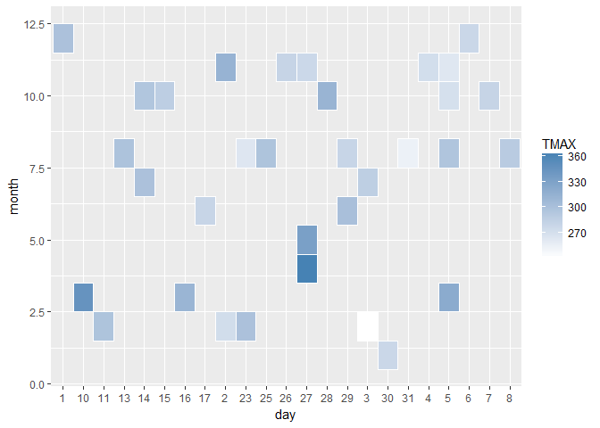
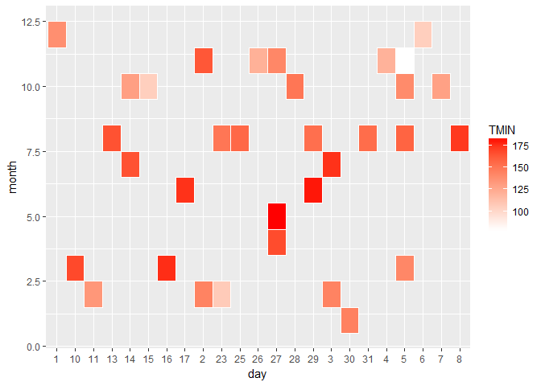

Tidy Clase
================

tidyr examples
==============

Cargando la data

``` r
who<- data.frame(tidyr::who)
```

transformando las columnas, haciendo unpivot

``` r
who1 <- who %>% 
  gather(new_sp_m014:newrel_f65, key = "key", value = "cases", na.rm = TRUE)
```

transformando las columnas, haciendo unpivot

``` r
who2 <- who1 %>% 
  mutate(key = stringr::str_replace(key, "newrel", "new_rel"))
```

Separando las columnas, haciendo unpivot

``` r
who3 <- who2 %>% 
  separate(key, c("new", "type", "sexage"), sep = "_")
```

Eliminando las columnas, que no sirve

``` r
who4 <- who3 %>% 
  select(-new, -iso2, -iso3)
```

Separando las columnas, por sexo y edad

``` r
who5 <- who4 %>% 
  separate(sexage, c("sex", "age"), sep = 1)
```

Trabajando con el dataset de weather
------------------------------------

``` r
weather <- read.delim(
  file = "http://stat405.had.co.nz/data/weather.txt",
  stringsAsFactors = FALSE
)
```

transformando las columnas, haciendo unpivot

``` r
weather1 <- weather %>% 
  gather(d1:d31, key = "rday", value = "cases", na.rm = TRUE)
```

transformando el new\_rel

``` r
weather2 <- weather1 %>% 
  mutate(rday = stringr::str_replace(rday, "newrel", "new_rel"))
```

Separando las columnas, haciendo unpivot

``` r
weather3 <- weather2 %>% 
  separate(rday, c("d", "day"), sep = 1) 
```

Eliminando las columnas, que no sirve

``` r
weather4 <- weather3 %>% 
  select(-d, -id, -year)
```

Agrupando, por elements

``` r
weather5 <- weather4 %>% 
  spread(element, cases)
```

Viendo la temperatura mas altas

``` r
ggplot(weather5, aes(day, month)) + 
  geom_tile(aes(fill = TMAX), colour = "white") + 
  scale_fill_gradient(low = "white", high = "steelblue")
```



Viendo la temperatura minimas

``` r
ggplot(weather5, aes(day, month)) + 
  geom_tile(aes(fill = TMIN), colour = "white") + 
  scale_fill_gradient(low = "white", high = "red")
```



Trabajando con el dataset de pew
--------------------------------

``` r
pew <- read.delim(
  file = "http://stat405.had.co.nz/data/pew.txt",
  header = TRUE,
  stringsAsFactors = FALSE,
  check.names = F
)
```

transformando las columnas, haciendo unpivot

``` r
pew1 <- pew %>% 
  gather(`<$10k`:`Don't know/refused`, key = "amount", value = "cases", na.rm = TRUE)
```
